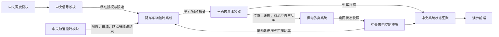

# 上京地铁调度仿真系统中期报告

## ——供电控制及仿真、车辆通信控制及仿真
  
**项目阶段：中期检查**  
**日期：2026 年 7 月 10 日**

## 一、项目概况

本项目面向地铁运营调度与多专业协同演示，建设一套由中央系统、演示前端、车辆仿真服务器和供电仿真系统组成的地铁调度仿真平台。中央系统内部包含调度、信号、轨道控制和供电控制模块；车辆控制系统随列车分布式部署，列车启动后向中央系统注册接入；仿真层分别提供车辆动力学仿真和牵引供电网络仿真。

系统总体运行关系如下：



根据《上京地铁系统立项说明书》，本人负责供电与车辆模块，原始任务包括供电分区状态、电压电流监测、供电故障告警、车辆运行状态、载客量与故障状态模拟。结合系统拆分后的实际架构，中期工作进一步落实为以下两条闭环：

1. 供电控制、供电仿真及供电与车辆之间的能量耦合；
2. 车辆注册通信、随车控制、车辆动力学仿真及车辆状态反馈。

本人不负责调度策略、信号联锁和轨道拓扑算法的内部实现。调度模块决定运营意图，信号模块负责移动授权和安全限速，轨道模块提供线路与占用约束；车辆模块只在这些约束内执行本车控制，供电模块只输出供电状态与能力约束，不直接越权控制列车。

## 二、中期目标与职责范围

| 工作方向 | 中期目标 | 当前结论 |
|---|---|---|
| 供电控制 | 建立供电分区、设备、状态、故障、能耗与操作接口 | 核心链路已实现 |
| 供电仿真 | 建立独立牵引供电仿真服务，计算接触轨电压、电流、供电方式与杂散电流风险 | 可运行，自检通过 |
| 供电—车辆耦合 | 将车辆牵引负荷和再生功率送入供电仿真，再将电压与功率约束返回车辆 | 网络链路已建立，长时间联动待验收 |
| 车辆通信 | 支持列车由外部车辆仿真服务器启动，并向中央系统注册、保持会话和状态镜像 | 已实现 |
| 车辆控制 | 建立随车自检、保护、牵引/制动决策和动力学状态机 | 已实现主要状态与保护逻辑 |
| 车辆仿真 | 建立每车控制队列与仿真队列，完成纵向动力学、能耗、取流和再生制动计算 | 可运行，单元测试通过 |
| 外部设备适配 | 预留司机台 PLC、UDP 外部仿真、RT-LAB 和供电点表接入 | 协议适配框架已建立，真实设备联调待完成 |

## 三、供电控制与供电仿真实现

### 3.1 中央供电控制

中央供电控制由 `PowerService`、`PowerIntegrationService`、供电拓扑服务和约束计算服务组成，主要完成以下工作：

- 维护牵引变电所、馈线、断路器、隔离开关、接触轨分区、检修闭锁和保护状态；
- 汇总车辆牵引功率、取流电流和再生制动功率；
- 计算每个供电分区的电压、电流、负荷、可用功率和受影响列车；
- 向车辆侧输出 `railVoltage`、`powerAvailableWatts` 等供电约束；
- 支持供电故障注入、故障清除、开关设备操作、事件记录和状态查询；
- 向中央快照、REST 接口和 WebSocket 输出供电状态、能耗和告警信息。

当前供电模型以 1500 V 直流第三轨为项目配置基准。正在结合 `线路数据(1).xls` 的 319 个区段、13 座车站和约 47.5 km 线路范围，将原演示供电配置调整为 5 个供电分区、5 座牵引变电所、接触轨分区、隔离开关、回流设备和杂散电流监测点。该配置调整尚在回归验证阶段，因此中期结论以“模型和链路已实现、参数继续校准”为准。

### 3.2 独立供电仿真系统

供电仿真系统以独立 Python 服务运行，默认端口为 9200，主要对象包括：

- 10 kV 中压母线与环网馈线；
- 牵引变电所及牵引变压器、整流器、直流快速断路器；
- 直流接触轨分区与隔离开关；
- 钢轨回流、排流柜和杂散电流监测点。

仿真服务接收中央系统下发的拓扑与参数，并接收车辆侧按供电分区聚合的牵引功率、再生功率和电流负荷。随后计算中压侧电流与母线压降、接触轨电压、双边/单边/越区供电状态、设备可用性和杂散电流风险，再向中央供电控制返回权威状态快照。

供电仿真已提供健康检查、拓扑查询、状态查询、启动配置、负荷注入和设备操作等接口。当前使用等值网络和规则模型，适合课程项目的系统联动演示，但不等同于工程级 PSCADA 或精细潮流计算。

### 3.3 供电故障与降级

当前供电链路支持或预留以下异常场景：

- 变电所或设备退出运行；
- 断路器跳闸、隔离开关断开；
- 接触轨失电、欠压、过流和供电能力下降；
- 检修闭锁及恢复送电状态；
- 外部供电仿真服务不可用时，中央系统回退本地供电模型；
- 外部状态与中央计算值存在偏差时，保留对比状态而不直接破坏中央安全约束。

供电故障对车辆的影响通过供电约束传递。车辆在失电时切除牵引并进入保护状态，在供电降额时限制牵引输出；供电模块只报告影响范围和可用能力，扣车、限速、折返等运营决策仍由调度与信号模块完成。

## 四、车辆通信、控制与仿真实现

### 4.1 列车启动与注册通信

车辆仿真服务器作为独立服务运行，默认端口为 9300。列车上线时，不由中央系统直接创建全部车辆内部状态，而是由车辆仿真服务器执行以下流程：

```text
车辆仿真服务器接收 launch 请求
→ 创建单车 VehicleRuntimeInstance
→ 唤醒该车控制队列和仿真队列
→ 向中央系统注册列车状态镜像
→ 中央系统建立车辆控制会话
→ 后续仿真 tick 中交换约束、控制结果和车辆状态
```

这一设计符合“车辆控制系统随列车分布式部署”的项目背景。中央系统负责统一时钟、全局约束和状态汇聚，各列车运行时负责本车控制与仿真。若外部车辆运行时暂时不可用，中央系统可切换到本地车辆控制和简化动力学模型，保证演示主循环不中断。

### 4.2 每车双队列模型

每辆列车内部设置两个有明确职责的顺序队列：

- **车辆控制队列**：接收信号移动授权、轨道条件、供电状态和经中央转换后的运行约束，执行本车自检、保护、牵引与制动决策；
- **车辆仿真队列**：根据控制指令和车辆参数计算速度、位置、加速度、牵引力、制动力、取流电流、牵引能耗和再生功率。

双队列的目的不是把每辆车拆成多个微服务，而是在一个车辆运行时服务内保持单车控制与物理推进的顺序性，防止同一辆车在同一仿真步长内出现状态乱序，同时仍可由统一管理器批量推进多列车。

### 4.3 随车控制状态机

车辆控制系统已将原有分散判断整理为显式动力学状态机。主要状态包括：

| 状态 | 典型触发条件 | 控制行为 |
|---|---|---|
| `SELF_CHECK_BLOCKED` | 车门未锁闭、自检失败、制动或牵引不可用 | 禁止牵引并施加制动 |
| `SAFETY_BRAKE` | 移动授权不足或 ATP 安全制动 | 紧急制动 |
| `POWER_LOSS` | 接触轨失电、受流失败或可用功率为零 | 切除牵引并制动 |
| `OVERLOAD_DERATED` | 载重超限或可用牵引单元不足 | 降低牵引输出 |
| `POWER_DERATED` | 供电能力下降但仍可受流 | 按可用功率降额牵引 |
| `MA_BRAKE` | 接近移动授权终点 | 按剩余距离比例制动 |
| `STATION_BRAKE` / `STATION_STOPPED` | 接近停车点或已停稳 | 进站制动或保持制动 |
| `OVERSPEED_BRAKE` | 实际速度超过允许速度 | 比例制动 |
| `ACCELERATING` / `CRUISING` / `COASTING` | 正常区间运行 | 牵引、维持或惰行 |

状态机优先级遵循“安全、自检和供电约束优先，正常牵引最后判断”的原则。信号系统提供移动授权和安全速度，车辆控制系统不自行扩大授权范围；车辆只可根据自身故障、车门、载重、受流和制动能力进一步收紧运行条件。

### 4.4 车辆动力学与能量计算

当前车辆仿真采用可运行的纵向动力学模型，主要考虑：

- 列车质量及载客量变化；
- 牵引力、常用制动力和紧急制动力；
- Davis 运行阻力、坡度阻力和黏着系数；
- 线路限速、移动授权距离、站点距离和停车距离；
- 接触轨电压、可用功率和失电保护；
- 牵引功率、取流电流、累计能耗和再生制动功率。

车辆侧已预留 HTTP FMU、UDP 外部仿真、RT-LAB API 和影子对比模式。当前权威可运行模型仍为 Java 简化模型；真实 FMU/RT-LAB 物理模型尚未完成替换和现场验收，答辩中不将其表述为已完成成果。

### 4.5 车辆状态、故障与外部接口

中央系统可获得的车辆状态已覆盖：位置、速度、运行模式、零速、车门、牵引、制动、受流、自检、载客率、载重、超载状态、可用牵引/制动单元、车辆保护原因、故障等级、数据质量、动力学状态、能耗及再生功率等。

车辆接口还包括：

- 车辆运行时健康状态和单车实例状态；
- 车辆故障注入、清除与故障记录；
- 车辆—信号状态与控制命令交换；
- 司机台 PLC 输入输出与网络屏状态投影；
- 外部 UDP 仿真报文与 RT-LAB 变量路径映射；
- 车辆状态、能耗和维修预留查询接口。

## 五、当前联动闭环

目前已经形成以下最小业务闭环：

1. 外部车辆仿真服务器启动列车并向中央系统注册；
2. 中央信号、轨道和供电模块在每个仿真步长生成车辆侧约束，调度意图经中央链路转换后参与约束计算；
3. 车辆控制队列根据约束和本车状态生成牵引、制动及保护决策；
4. 车辆仿真队列计算新的位置、速度、能耗、取流电流和再生功率；
5. 车辆负荷送入供电仿真，供电仿真返回接触轨电压和供电能力；
6. 中央系统更新车辆与供电状态，并将快照输出给演示前端；
7. 任一外部服务异常时，中央系统可进入本地降级模式，保持仿真主循环可运行。

这一闭环体现了本阶段的核心成果：车辆运行会影响供电负荷，供电状态也会反向限制车辆牵引，两个模块不再是相互独立的静态展示数据。

## 六、测试与中期完成度

### 6.1 本次验证结果

| 验证对象 | 结果 | 说明 |
|---|---|---|
| 独立车辆运行时服务 | 7 项测试全部通过 | 覆盖实例队列、批量步进、基础牵引/失电和供电负荷转发等 |
| 独立供电仿真服务 | 自检通过 | 覆盖启动、负荷注入、状态计算和设备操作的基础链路 |
| 中央后端 | 106 项测试中 103 项通过、3 项未通过 | 主要车辆/供电单元测试通过；仍有配置更新与接口投影回归问题 |
| 代码格式检查 | 通过 | 当前差异未发现空白字符错误 |

中央后端当前 3 项未通过包括：

1. 五供电分区新配置与旧接口测试中“两分区”数量断言不一致；
2. 供电参数调整后，外部电压偏差测试仍使用旧阈值；
3. 司机台 PLC 输入到信号车辆接口的 `atoStartFlag` 投影与测试期望不一致。

这些问题不否定已完成的基础链路，但说明当前仍处于配置扩展后的回归收敛阶段，必须在中期后优先修复并重新执行全量测试。

### 6.2 中期完成度判断

截至中期，供电与车辆两条主链路的架构拆分、核心对象、服务接口、控制/仿真队列、状态机、能量耦合和故障降级机制已基本建立，已经具备继续开展三服务联调和前端演示的条件。

当前尚不能认定为完成的内容包括：

- `backend + vehicle-runtime-service + power-network-service` 长时间连续联动；
- 多列车压力测试和性能边界测量；
- 真实 FMU/RT-LAB 物理模型接入；
- 真实 PSCADA 点表、Modbus TCP 或 OPC UA 接入；
- 供电模型物理参数标定和工程级潮流验证；
- 数据库租约恢复、完整维修工单和停送电审批闭环；
- 当前 3 项后端回归失败的修复。

## 七、存在问题与下一阶段计划

### 7.1 当前问题

1. 真实线路数据扩大到 47.5 km、5 个供电分区后，部分旧测试和演示参数尚未同步更新。
2. 供电仿真仍为等值规则模型，需要通过典型牵引负荷、欠压和越区供电场景校准参数。
3. 车辆简化动力学可支撑系统联动，但与真实列车牵引特性仍存在差距。
4. 三服务网络链路虽已建立，但尚缺少长时间、并发和故障恢复验收数据。
5. 外部设备协议已有框架，现场 IP、端口、点表和真实设备行为仍需联调确认。

### 7.2 下一阶段计划

1. 修复 3 项后端回归失败，建立“全量测试通过”作为后续合入门槛；
2. 固化 5 个供电分区配置，核对线路里程、变电所位置、分区边界和设备点表；
3. 完成三服务联合启动与长时间运行测试，记录延迟、丢包、降级和恢复结果；
4. 设计正常运行、供电欠压、变电所跳闸、列车超载、车门未锁和通信中断等答辩演示场景；
5. 对车辆牵引/制动、供电压降和再生制动参数进行校准；
6. 根据现场条件完成司机台、信号网络和供电点表的真实联调；
7. 完善日志、告警、操作审计、数据库持久化和前端展示字段。

## 八、中期总结

本人中期工作的重点不是分别制作一组车辆数据和一组供电数据，而是建立“车辆控制—车辆仿真—牵引负荷—供电仿真—供电约束—车辆保护”的双向联动链路。目前车辆启动注册、随车控制队列、动力学仿真、供电网络仿真、状态回传和故障降级已经具备可运行基础；下一阶段将重点完成回归问题收敛、三服务长时间联调、参数校准和现场设备接入，使系统从“模块可运行”进入“完整场景可稳定演示”的阶段。
