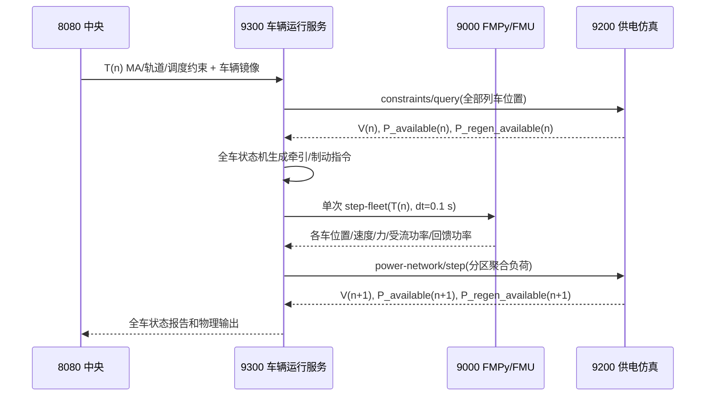

# 真实车辆 FMU（FMI 2.0 Co-Simulation）集成实施计划

> 文档状态：实施基线冻结版
>
> 本文用途：作为后续代码实施、联调、验收和回滚的唯一执行清单。
>
> 本次修订范围：只完善计划，不代表真实 FMU 已经接入。

## 分计划索引

本文件保留完整总计划和冻结的技术契约；分计划用于分阶段执行、记录测试证据和控制提交范围。若分计划与总计划冲突，以本文件为准，并先同步修订总计划。

| 执行阶段 | 覆盖工作包 | 分计划 |
|---|---|---|
| 接口与参数基线 | WP0～WP1 | [01-接口与参数基线](真实FMU集成实施计划/01-接口与参数基线-WP0-WP1.md) |
| FMU模型、制品与运行服务 | WP2～WP4 | [02-FMU模型构建与运行服务](真实FMU集成实施计划/02-FMU模型构建与运行服务-WP2-WP4.md) |
| 车辆与供电闭环 | WP5～WP6 | [03-车辆供电闭环](真实FMU集成实施计划/03-车辆供电闭环-WP5-WP6.md) |
| 部署、验收与收口 | WP7～WP8 | [04-部署验收与收口](真实FMU集成实施计划/04-部署验收与收口-WP7-WP8.md) |

## 0. 状态标记与执行规则

本文统一使用以下标记：

- **[已完成]**：当前仓库已经具备并经代码核验的能力。
- **[待实施]**：后续必须修改代码或部署配置才能具备的能力。
- **[验收]**：完成对应工作包前必须取得的可重复证据。
- **[不在范围]**：本次真实 FMU 集成不修改的内容。

实施时必须遵守以下规则：

1. 按 `WP0 -> WP1 -> WP2 -> WP3 -> WP4 -> WP5 -> WP6 -> WP7 -> WP8` 顺序执行；未达到上一工作包退出条件不得进入下一工作包。
2. 车辆物理接口、单位和功率口径以本文为准；发现代码与本文冲突时先修订契约和测试，再修改实现。
3. 不在代码、配置或文档中写负责人姓名，以工作包、提交和验收记录追踪进度。
4. 不修改演示前端 `App.vue`；本计划只要求保持现有前端消费字段兼容。
5. 真实 `.fmu`、容器镜像和运行日志是生成物，不直接提交 `.fmu` 二进制到 Git。

## 1. 建设目标和完成定义

### 1.1 建设目标

在不改变中央调度和信号职责的前提下，形成可运行的多列车车电闭环：

```text
8080 中央系统
  产生 MA、信号、轨道、调度约束并镜像车辆状态
        |
        v
9300 车辆运行服务
  车辆状态机产生牵引/制动指令，组织全车 100 ms 物理批次
        |
        v
9000 FMU 执行服务
  Python + FMPy，一份 FMI 2.0 CS FMU、多辆列车独立实例
        |
        v
9300 汇总受流功率、回馈功率、电流和新位置
        |
        v
9200 供电仿真服务
  按供电段求解下一周期网压、受流侧可用功率、再生吸收能力
        |
        +--------------------> 回写 9300，影响下一 100 ms 车辆物理步
```

### 1.2 “真实 FMU 已接入”的完成定义

只有同时满足以下条件，项目才能宣称“已接入 FMI 2.0 Co-Simulation 车辆 FMU”：

1. OpenModelica 固定容器能够从 Modelica 源码导出 FMI 2.0 Co-Simulation FMU。
2. 9000 使用 FMPy `FMU2Slave` 持久管理实例，而不是调用 Python 简化模型。
3. 9300 每 100 ms 一次批量调用 9000，并对每辆列车维持独立实例生命周期。
4. 9200 返回的网压、电网侧牵引可用功率和再生吸收功率进入下一车辆物理步。
5. 两辆同供电段列车通过 9200 发生可测的物理耦合。
6. WP8 中的接口、物理、性能、降级和回归验收全部通过。

未满足上述条件前，只能表述为“已具备 Java fallback、FMU 接口草案和车电闭环底座”。

## 2. 已核验的当前基线

### 2.1 服务基线与目标

| 服务 | 当前实现 | 当前状态 | 本计划目标 |
|---|---|---|---|
| 8080 中央系统 | 调度、信号、轨道、MA、状态镜像；可调用 9300 | **[已完成]** | 保持中央只负责信号和控制编排，不直接驱动车辆 FMU，不成为供电权威。 |
| 9300 车辆运行服务 | Spring Boot；`VehicleControlQueue` 生成控制指令；`VehicleSimulationQueue` 执行 Java 简化模型；逐车执行后汇总供电负荷 | **[已完成底座]** | 改为三阶段批处理，通过一个 9000 请求完成全车物理步，并保留 Java fallback。 |
| 9000 FMU 服务 | FastAPI + FMPy；启动时校验并解包一次真实FMU；按`trainId`维护持久`FMU2Slave`，支持完整生命周期、批次预检和错误隔离 | **[已完成WP4，尚未接入9300]** | WP5由9300在每个tick发起一次批量调用；9000继续只负责车辆物理执行。 |
| 9200 供电仿真 | FastAPI；按分区聚合牵引/再生负荷，计算网压与`powerAvailableWatts`；已冻结并输出`regenPowerAvailableWatts`字段 | **[已完成接口底座]** | WP6实现真实再生预算，保持受流功率和回馈功率为电网侧口径。 |
| 演示前端 | 消费中央快照中的现有车辆、供电字段 | **[不在范围]** | 不修改`App.vue`；通过向后兼容字段保证页面继续工作。 |

### 2.2 当前能力与缺口

| 能力 | 当前证据 | 状态 | 需要完成的工作包 |
|---|---|---|---|
| 100 ms 中央仿真周期 | `backend/src/main/resources/application.yml` 中 `tick-millis: 100` | **[已完成]** | WP8 只验证，不再列为改造项。 |
| 总质量传入车辆物理模型 | 9300 `VehicleLoadPolicy` 和 `VehiclePhysicsInputDto.trainMassKg` | **[已完成]** | 已由WP1改成YAML参数对象；质量继续每步输入。 |
| 车辆参数 YAML | `config/train_params.yaml` | **[已完成]** | 9300/9000均真实加载、严格校验并暴露相同`parameterSetId`。 |
| Modelica 一维车辆模型 | `fmu-service/modelica/TrainTractionBrake.mo` | **[已完成WP2]** | 已实现内部位置/速度/能量状态及牵引、制动、再生、阻力、坡道、黏着和欠压保护。 |
| FMU 映射契约 | `config/fmu_mapping.yaml` | **[已完成接口冻结]** | WP0已完成分组、生命周期和功率口径；WP2按该契约回补Modelica变量。 |
| 真实 `.fmu` | 固定OpenModelica镜像可生成FMI 2.0 Co-Simulation制品，生成目录不入Git | **[已完成WP3]** | WP7部署时由镜像构建阶段生成并携带清单。 |
| FMPy 依赖和实例 | `fmpy==0.3.30`，9000启动时完成制品和41个映射变量校验 | **[已完成WP4]** | WP5接入9300批量调用。 |
| 一份 FMU、多实例 | 一份已解包FMU、每车一个独立持久`FMU2Slave`；100步隔离测试通过 | **[已完成WP4]** | WP8扩大车数和持续时间验收。 |
| 9300 批量 FMU 调用 | `VehicleRuntimeManager` 当前在循环内同时完成控制和物理计算 | **[待实施]** | WP5。 |
| 供电牵引闭环 | 9300 查询 9200、提交分区负荷、缓存下一周期约束 | **[已完成底座]** | WP6 用真实 FMU 的电功率完善闭环。 |
| 再生吸收能力约束 | 三服务DTO已有`regenPowerAvailableWatts`，9200当前输出0占位 | **[已完成接口，待实现物理预算]** | WP6实现瓦特级预算计算和多车分配。 |

### 2.3 已确认差异的处理状态

1. 100 ms周期原本被误列为待实施，现已固定为既有基线，WP4实际通信步长严格校验为`0.1 s`。
2. 9300和9000已在WP1改为真实加载同一`train_params.yaml`，不再以重复硬编码作为参数来源。
3. WP2已将车门、紧急制动和受流状态实现为Boolean，将故障码实现为Integer。
4. WP2已按机械侧/电网侧分别实现四个功率字段；`3.2 MW`只作为电机侧机械功率上限。
5. WP4正常STEP只写每步控制和供电输入，不覆盖FMU内部位置、速度和累计能量；RESET/RESYNC才重建状态。
6. `trainMassKg`保持每步输入，以承接9300上下客后的实时总质量变化。
7. 9200的真实再生预算和9300到9000的生产批量调用仍分别由WP6、WP5实施，不在WP2～WP4内提前宣称完成。

## 3. 冻结的架构与职责边界

### 3.1 服务职责

| 服务 | 必须承担 | 明确不承担 |
|---|---|---|
| 8080 | 调度、MA、进路、轨道约束、信号状态、车辆状态镜像、监控 | 不调用 FMU；不计算车辆连续动力学；不重新计算 9200 的权威供电约束。 |
| 9300 | 列车生命周期、ATO/ATP/TCMS 状态机、牵引/制动指令、9000 批量调用、逐车降级、分区负荷聚合 | 不求解供电潮流；不让 FMU决定发车、MA、站停或信号放行。 |
| 9000 | FMU 校验、实例化、初始化、100 ms 步进、实例释放、物理量输出和 FMI 故障翻译 | 不实现调度/信号状态机；不维护线路拓扑；不直接写 9200。 |
| 9200 | 供电拓扑、区段网压、可用受流功率、再生吸收能力、供电状态与保护 | 不生成车辆牵引/制动指令；不改变列车运行状态。 |

### 3.2 正常时序



耦合采用显式一周期延迟：`T(n)` 的车辆负荷用于求解 `T(n+1)` 的供电约束。首版不在一个 100 ms 周期内进行车辆—电网隐式迭代。

### 3.3 FMU 内外状态边界

- 9300 状态机继续决定`tractionCommand`、`brakeCommand`、`emergencyBrakeCommand`和车门联锁。
- FMU维护位置、速度、累计牵引能量、累计再生能量等连续状态。
- `speedLimit`、MA距离、站距、停车距离、状态机状态和约束原因进入请求日志及追踪数据，但不作为首版 FMU 必需物理输入。
- `curveRadiusMeters`首版只保留为元数据；不添加没有标定依据的曲线阻力。
- `doorClosed=false`时牵引必须归零；`emergencyBrakeCommand=true`时使用紧急制动力上限。这两个条件是 FMU 内部的硬联锁，不改变上层状态机职责。

## 4. 工具链、制品和部署基线

### 4.1 固定版本

| 项目 | 固定值 | 用途 |
|---|---|---|
| FMI 标准 | FMI 2.0.5 Co-Simulation | 模型接口和运行生命周期基线。 |
| 通信步长 | 0.1 s | 所有列车实例固定步长；首版不开放 50 ms。 |
| FMU 导出器 | `openmodelica/openmodelica:v1.27.0-minimal` | 唯一可复现导出环境。 |
| 导出/运行平台 | `linux/amd64` | 避免依赖开发机 Darwin/ARM 二进制。 |
| Python | 3.12 | 9000 运行环境。 |
| FMPy | 0.3.30 | FMI 2.0 Co-Simulation 运行。 |
| FastAPI | 0.139.0 | 9000 HTTP 服务。 |
| Uvicorn | 0.51.0 | 9000 ASGI 服务器。 |
| Java | 21 | 保持 9300 当前编译基线。 |
| Spring Boot | 3.3.5 | 保持 9300 当前父版本。 |

### 4.2 镜像与 FMU 制品规则

1. 第一次实施 WP3 时执行：

   ```bash
   docker pull --platform linux/amd64 openmodelica/openmodelica:v1.27.0-minimal
   docker image inspect openmodelica/openmodelica:v1.27.0-minimal --format '{{index .RepoDigests 0}}'
   ```

2. 将输出的`sha256`完整写入 FMU 构建 Dockerfile 和构建清单；后续构建使用`FROM openmodelica/openmodelica@sha256:...`，禁止继续使用浮动标签。
3. OpenModelica 构建阶段调用：

   ```modelica
   buildModelFMU(RailwaySimVehicle.TrainTractionBrake, version="2.0", fmuType="cs");
   ```

4. 使用多阶段镜像：第一阶段导出 FMU，第二阶段以`python:3.12-slim`为基础运行 FastAPI/FMPy。
5. `.fmu`输出到`fmu-service/build/`并加入`.gitignore`；运行镜像复制该制品。Git只跟踪：
   - Modelica 源码和`.mos`构建脚本；
   - 锁定版本的依赖文件；
   - `fmu-manifest.json`模板和构建脚本；
   - 模型变量清单、参数清单和测试代码。
6. 每次构建生成`fmu-manifest.json`，至少包含：
   - `modelVersion`
   - `fmiVersion`
   - `fmuType`
   - `fmuSha256`
   - `parameterSchemaVersion`
   - `openModelicaImageDigest`
   - `targetPlatform`
   - `sourceCommit`
   - `builtAt`

## 5. 参数事实来源、单位和功率口径

### 5.1 车辆参数事实来源

`config/train_params.yaml`是车辆标定参数的唯一事实来源。当前已核验值如下：

| YAML 路径 | 数值 | 单位 | FMU 用途 |
|---|---:|---|---|
| `emptyMassKg` | 198000 | kg | 9300计算总质量。 |
| `maxLoadMassKg` | 72000 | kg | 9300根据实时载荷计算总质量。 |
| `traction.maxPowerWatts` | 3200000 | W | **电机侧最大机械牵引功率**。 |
| `traction.maxTractionForceNewtons` | 240000 | N | 最大牵引力。 |
| `traction.efficiency` | 0.88 | 1 | 受流电功率转换为机械功率的效率。 |
| `brake.maxServiceBrakeForceNewtons` | 220000 | N | 常用制动总力上限。 |
| `brake.maxEmergencyBrakeForceNewtons` | 300000 | N | 紧急制动总力上限。 |
| `brake.regenBrakeRatio` | 0.45 | 1 | 总制动力中优先尝试再生的比例。 |
| `brake.regenEfficiency` | 0.35 | 1 | 机械再生功率转为电网回馈功率的效率。 |
| `resistance.davisA` | 1800 | N | Davis 常数项。 |
| `resistance.davisB` | 45 | N/(m/s) | Davis 一次项。 |
| `resistance.davisC` | 3.2 | N/(m/s)^2 | Davis 二次项。 |
| `power.nominalVoltage` | 1500 | V | 车辆额定受流电压。 |
| `power.minVoltage` | 1000 | V | 欠压故障阈值。 |
| `power.cutoffVoltage` | 900 | V | 牵引切除阈值。 |

实现规则：

1. 9300 增加`vehicle-runtime.train-params-path`，默认`config/train_params.yaml`。
2. 9300 启动时读取并完整校验 YAML，禁止静默使用另一组硬编码参数。
3. `parameterSetId`定义为`sha256:`加 YAML 原始文件字节的 SHA-256；9300和9000必须基于同一挂载文件计算，避免跨语言序列化差异。
4. 9000 在 INIT 时将 YAML 标定值写入 FMI `causality=parameter`、`variability=fixed`变量；参数只在初始化模式内写入。
5. 请求中的`parameterSetId`与9000当前参数集不一致时返回 HTTP 409，不允许继续步进。
6. 9300每步根据空车质量、实时载荷质量计算`trainMassKg`。上下客导致质量变化时不重建 FMU实例，直接在下一步更新质量输入。
7. `config/power_third_rail.yaml`继续是9200供电拓扑和供电能力事实来源；车辆YAML中的电压值只定义车辆保护阈值，不替代供电网络配置。

### 5.2 单位规则

- 距离：m；速度：m/s；加速度：m/s²；时间：s。
- 质量：kg；力：N；电压：V；电流：A。
- 机械功率和电功率均使用 W，但字段名必须明确包含`Mechanical`或保留已定义的电网侧语义。
- 累计能量沿用现有接口的 kWh。
- 坡度`gradient`使用无量纲坡度比；例如`10‰`必须输入`0.010`。
- 车辆速度首版是沿里程正方向的非负幅值，不实现倒车和带符号里程。

### 5.3 牵引功率口径与公式

定义：

- `P_motor_rated = maxPowerWatts`：电机侧额定机械功率，当前为 3.2 MW。
- `P_grid_available = powerAvailableWatts`：9200给出的受流侧可用电功率。
- `eta_t = tractionEfficiency`：牵引效率，当前为0.88。
- `v_floor = 0.5 m/s`：低速除零保护，仅用于计算功率限制力。

每步按以下顺序计算：

```text
P_motor_supply = P_grid_available * eta_t
P_motor_limit  = min(P_motor_rated, P_motor_supply)

F_command  = clamp(tractionCommand, 0, 1) * maxTractionForceNewtons
F_power    = P_motor_limit / max(speed, v_floor)
F_adhesion = adhesionCoefficient * trainMassKg * g
F_traction = min(F_command, F_power, F_adhesion)

P_traction_mechanical = F_traction * speed
P_traction_electrical = P_traction_mechanical / eta_t
I_traction            = P_traction_electrical / max(lineVoltageVolts, 1 V)
```

硬约束：

- `P_traction_mechanical <= 3.2 MW`。
- `P_traction_electrical <= powerAvailableWatts`，允许浮点误差1 W。
- `tractionPowerWatts`保持现有语义，表示**受流侧电功率**，供9300聚合并提交9200。
- 新增`mechanicalTractionPowerWatts`，表示电机侧机械功率，仅用于物理诊断、验证和展示扩展。
- 不得把3.2 MW直接作为受流侧电功率上限；当机械功率达到3.2 MW且效率为0.88时，理论受流功率约为3.636 MW。

### 5.4 阻力、制动和状态积分

```text
F_resistance = davisA + davisB * speed + davisC * speed^2
F_grade      = trainMassKg * g * gradient
F_net        = F_traction - F_brake - F_resistance - F_grade
acceleration = clamp(F_net / trainMassKg, -1.3, 1.0)
```

- 常用制动：`F_brake = brakeCommand * maxServiceBrakeForceNewtons`。
- 紧急制动：`emergencyBrakeCommand=true`时，`F_brake=maxEmergencyBrakeForceNewtons`，并强制牵引归零。
- `brakeForceNewtons`表示总制动力；`regenBrakeForceNewtons`是总制动力的子集。合力计算只能减一次`F_brake`。
- 采用 FMU 内部积分器推进速度和位置；输出速度不得小于0。
- 首版保留加速度钳制`[-1.3, 1.0] m/s²`，与现有Java行为兼容。后续改变该范围必须另行标定并更新验收基线。

### 5.5 再生制动口径与公式

定义：

- `P_regen_grid_available = regenPowerAvailableWatts`：9200分配给该车的电网侧可接收回馈功率。
- `eta_r = regenEfficiency`：机械再生功率到电网回馈功率的效率。

```text
F_regen_candidate          = regenBrakeRatio * F_brake
P_regen_candidate_mech     = F_regen_candidate * speed
P_regen_motor_limit        = min(P_regen_candidate_mech, maxPowerWatts)
P_regen_grid_limit_mech    = P_regen_grid_available / eta_r
P_regen_mechanical         = min(P_regen_motor_limit, P_regen_grid_limit_mech)
F_regen                    = min(F_regen_candidate,
                                 P_regen_mechanical / max(speed, v_floor))
P_regen_electrical         = F_regen * speed * eta_r
F_non_regen                = F_brake - F_regen
```

硬约束：

- `mechanicalRegenPowerWatts`表示机械侧再生功率。
- 现有`regenPowerWatts`表示回馈电网的电功率，保持非负。
- `regenPowerWatts <= regenPowerAvailableWatts`，允许浮点误差1 W。
- 电网不接收再生时，`regenBrakeForceNewtons=0`，但总`brakeForceNewtons`不变，差额由空气/摩擦制动或制动电阻承担。
- 牵引和回馈功率使用两个独立非负字段；不得用负`tractionPowerWatts`表达回馈。

### 5.6 能量积分

```text
der(energyConsumedKwh)    = tractionPowerWatts / 3_600_000
der(energyRegeneratedKwh) = regenPowerWatts / 3_600_000
```

这里的导数自变量为秒，因此上述结果单位为kWh/s。累计能耗和累计再生能量在正常 STEP 中只能非递减；仅 RESET/RESYNC 可重新设置初值。

### 5.7 网压约束边界

- 9200已将网络状态、网压、供电模式和电流能力折算到`powerAvailableWatts`；FMU不得再使用相同规则进行第二次降额。
- `lineVoltageVolts <= 900 V`、`currentCollectionAvailable=false`或`powerAvailableWatts<=0`时牵引输出为0。
- `900 V < lineVoltageVolts < 1000 V`时报告`LOW_VOLTAGE`，但具体可用功率仍服从9200提供的`powerAvailableWatts`。
- 受流电流使用实际受流电功率除以实际网压计算，不使用3.2 MW机械功率直接除电压。

## 6. 冻结的变量契约

### 6.1 FMI 参数

以下变量在`modelDescription.xml`中声明为`causality=parameter`、`variability=fixed`，由9000在初始化模式内从YAML写入：

| FMI变量 | 类型 | 单位 | YAML来源 |
|---|---|---|---|
| `maxMechanicalTractionPowerWatts` | Real | W | `traction.maxPowerWatts` |
| `maxTractionForceNewtons` | Real | N | `traction.maxTractionForceNewtons` |
| `tractionEfficiency` | Real | 1 | `traction.efficiency` |
| `maxServiceBrakeForceNewtons` | Real | N | `brake.maxServiceBrakeForceNewtons` |
| `maxEmergencyBrakeForceNewtons` | Real | N | `brake.maxEmergencyBrakeForceNewtons` |
| `regenBrakeRatio` | Real | 1 | `brake.regenBrakeRatio` |
| `regenEfficiency` | Real | 1 | `brake.regenEfficiency` |
| `davisA` | Real | N | `resistance.davisA` |
| `davisB` | Real | N/(m/s) | `resistance.davisB` |
| `davisC` | Real | N/(m/s)^2 | `resistance.davisC` |
| `minimumVoltageVolts` | Real | V | `power.minVoltage` |
| `cutoffVoltageVolts` | Real | V | `power.cutoffVoltage` |
| `initialPositionMeters` | Real | m | INIT/RESYNC请求 |
| `initialSpeedMetersPerSecond` | Real | m/s | INIT/RESYNC请求 |
| `initialEnergyConsumedKwh` | Real | kWh | INIT/RESYNC请求 |
| `initialEnergyRegeneratedKwh` | Real | kWh | INIT/RESYNC请求 |

### 6.2 每步 FMU 输入

| 9300/9000字段 | FMI变量 | FMI类型 | 单位/范围 | 来源 | 更新规则 |
|---|---|---|---|---|---|
| `trainMassKg` | `trainMassKg` | Real | kg，>0 | 9300实时总质量 | 每步写入。 |
| `tractionCommand` | `tractionCommand` | Real | 0..1 | 9300状态机 | 每步写入。 |
| `brakeCommand` | `brakeCommand` | Real | 0..1 | 9300状态机 | 每步写入。 |
| `emergencyBrakeCommand` | `emergencyBrakeCommand` | Boolean | true/false | ATP/车辆保护 | 每步用`setBoolean`写入。 |
| `doorClosed` | `doorClosed` | Boolean | true/false | TCMS车门状态 | 每步用`setBoolean`写入。 |
| `gradient` | `gradient` | Real | 坡度比 | 轨道约束 | 每步写入。 |
| `lineVoltageVolts` | `lineVoltageVolts` | Real | V，>=0 | 9200 | 每步写入。现有JSON字段`railVoltage`在9000映射到该变量。 |
| `powerAvailableWatts` | `powerAvailableWatts` | Real | 电网侧W，>=0 | 9200 | 每步写入。 |
| `regenPowerAvailableWatts` | `regenPowerAvailableWatts` | Real | 电网侧W，>=0 | 9200 | 每步写入。 |
| `currentCollectionAvailable` | `currentCollectionAvailable` | Boolean | true/false | 9200 | 每步写入。 |
| `adhesionCoefficient` | `adhesionCoefficient` | Real | 0.2..1.0 | 9300环境输入 | 每步写入。 |
| `stepSizeSeconds` | — | — | 固定0.1 s | 批次信封 | 只作为`doStep`参数，不建普通FMI输入。 |

### 6.3 请求中保留但不写入 FMU 的字段

| 字段 | 正常 STEP 语义 |
|---|---|
| `trainId` | 9000实例键，不是物理变量。 |
| `positionMeters`、`speedMetersPerSecond` | INIT/RESYNC时设为初值；STEP时仅用于漂移监测，不覆盖FMU状态。 |
| `previousEnergyConsumedKwh`、`previousEnergyRegeneratedKwh` | INIT/RESYNC时设为初值；STEP时仅校验累计量漂移。 |
| `speedLimitMetersPerSecond` | 9300控制上下文和日志。 |
| `movementAuthorityDistanceMeters` | 9300控制上下文和日志。 |
| `stationDistanceMeters`、`stoppingDistanceMeters` | 9300站停控制上下文和日志。 |
| `dynamicsState`、`dynamicsConstraintReason` | 9300状态机诊断。 |
| `curveRadiusMeters` | 首版元数据，不参与FMU公式。 |
| `sectionId` | 9000批次诊断和再生预算追踪，不写入FMU。 |

### 6.4 FMU 输出及外部语义

| FMI变量 | JSON/DTO字段 | 类型 | 单位 | 语义与消费者 |
|---|---|---|---|---|
| `positionMeters` | `newPositionMeters` | Real | m | 9300写回车辆状态和供电段定位。 |
| `speedMetersPerSecond` | `newSpeedMetersPerSecond` | Real | m/s | 9300下一周期控制输入。 |
| `accelerationMetersPerSecondSquared` | 同名 | Real | m/s² | 状态快照和物理验证。 |
| `tractionForceNewtons` | 同名 | Real | N | 机械牵引诊断。 |
| `brakeForceNewtons` | 同名 | Real | N | 总制动力。 |
| `regenBrakeForceNewtons` | 同名 | Real | N | 总制动力中的再生部分。 |
| `mechanicalTractionPowerWatts` | 同名，新字段 | Real | W | 电机侧机械牵引功率。 |
| `tractionPowerWatts` | 同名 | Real | W | 受流侧电功率，9300聚合后提交9200。 |
| `railCurrentAmps` | 同名 | Real | A | 受流电流，满足`I≈P/V`。 |
| `mechanicalRegenPowerWatts` | 同名，新字段 | Real | W | 机械侧再生功率。 |
| `regenPowerWatts` | 同名 | Real | W | 回馈电网功率，9300聚合后提交9200。 |
| `energyConsumedKwh` | 同名 | Real | kWh | 累计受流电能。 |
| `energyRegeneratedKwh` | 同名 | Real | kWh | 累计回馈电能。 |
| `faultCodeValue` | 9000映射为`faultCode` | Integer | 枚举 | 避免依赖FMI String兼容性。 |

### 6.5 故障码映射

| FMU整数 | 9000字符串 | 含义 |
|---:|---|---|
| 0 | `OK` | 物理步正常。 |
| 10 | `DOOR_NOT_LOCKED` | 车门未联锁，牵引切除。 |
| 20 | `ATP_BRAKE` | 紧急制动输入有效。 |
| 30 | `CURRENT_COLLECTION_LOST` | 失电、受流不可用或电压低于切除阈值。 |
| 31 | `LOW_VOLTAGE` | 低于最低电压但高于切除阈值。 |
| 90 | `FMU_INTERNAL_ERROR` | FMU内部数值或状态错误。 |

以下为集成层故障码，不由FMU输出：

- `FMU_STEP_FAILED`
- `FMU_INSTANCE_NOT_FOUND`
- `FMU_PARAMETER_SET_MISMATCH`
- `FMU_TICK_CONFLICT`
- `EXTERNAL_SIM_FALLBACK`

### 6.6 `fmu_mapping.yaml`目标结构

映射文件必须分成`parameters`、`initialState`、`stepInputs`、`metadata`、`outputs`五组。`speedLimit`、`maDistance`和`curveRadius`不得留在`stepInputs`中。Boolean必须声明`type: Boolean`，故障码声明`type: Integer`。9000启动时根据`modelDescription.xml`验证每个变量的名称、类型、单位、因果性和Value Reference，任一必需变量不匹配即拒绝启动。

## 7. 9000 批量 API 与生命周期

### 7.1 `POST /step-fleet`请求

```json
{
  "tick": 12001,
  "simulationTimeSeconds": 1200.1,
  "stepSizeSeconds": 0.1,
  "modelVersion": "TrainTractionBrake/1.0.0",
  "parameterSetId": "sha256:<64位十六进制>",
  "traceId": "vehicle-tick-12001",
  "trains": [
    {
      "trainId": "TR-001",
      "lifecycleCommand": "STEP",
      "sectionId": "P-001",
      "positionMeters": 1250.0,
      "speedMetersPerSecond": 15.0,
      "trainMassKg": 236000.0,
      "tractionCommand": 0.8,
      "brakeCommand": 0.0,
      "emergencyBrakeCommand": false,
      "doorClosed": true,
      "gradient": 0.01,
      "curveRadiusMeters": 1000.0,
      "railVoltage": 1420.0,
      "powerAvailableWatts": 3700000.0,
      "regenPowerAvailableWatts": 0.0,
      "currentCollectionAvailable": true,
      "adhesionCoefficient": 0.9,
      "previousEnergyConsumedKwh": 12.5,
      "previousEnergyRegeneratedKwh": 1.2,
      "speedLimitMetersPerSecond": 22.2,
      "movementAuthorityDistanceMeters": 700.0,
      "stationDistanceMeters": 900.0,
      "stoppingDistanceMeters": 140.0,
      "dynamicsState": "TRACTION",
      "dynamicsConstraintReason": "NONE"
    }
  ]
}
```

约束：

- `stepSizeSeconds`首版必须精确为`0.1`；否则HTTP 400。
- 一个批次中`trainId`不得重复。
- `modelVersion`和`parameterSetId`必须与9000当前元数据一致。
- `INIT`和`RESYNC`必须携带完整初始位置、速度和累计能量。
- 9300在新列车首次进入9000时发送`INIT`，以后发送`STEP`。

### 7.2 成功响应

```json
{
  "tick": 12001,
  "modelVersion": "TrainTractionBrake/1.0.0",
  "parameterSetId": "sha256:<64位十六进制>",
  "traceId": "vehicle-tick-12001",
  "trainOutputs": [
    {
      "trainId": "TR-001",
      "newPositionMeters": 1251.505,
      "newSpeedMetersPerSecond": 15.1,
      "accelerationMetersPerSecondSquared": 1.0,
      "tractionForceNewtons": 210000.0,
      "brakeForceNewtons": 0.0,
      "regenBrakeForceNewtons": 0.0,
      "mechanicalTractionPowerWatts": 3150000.0,
      "tractionPowerWatts": 3579545.45,
      "railCurrentAmps": 2520.81,
      "mechanicalRegenPowerWatts": 0.0,
      "regenPowerWatts": 0.0,
      "energyConsumedKwh": 12.5994318,
      "energyRegeneratedKwh": 1.2,
      "faultCode": "OK",
      "instanceState": "ACTIVE",
      "dataQuality": "GOOD",
      "fmiStatus": "OK"
    }
  ],
  "trainErrors": []
}
```

兼容规则：

- 现有字段名称和语义保持不变。
- 新增字段只做向后兼容扩展；8080和前端可以忽略未知字段。
- 单个FMU实例`doStep`失败时，HTTP仍返回200；成功列车保留在`trainOutputs`，失败列车进入`trainErrors`，9300只对失败列车执行Java fallback。

### 7.3 单车错误项

```json
{
  "trainId": "TR-002",
  "faultCode": "FMU_STEP_FAILED",
  "message": "fmi2DoStep returned fmi2Error",
  "instanceState": "FAILED",
  "dataQuality": "ERROR",
  "fmiStatus": "ERROR"
}
```

### 7.4 生命周期命令

| 命令 | 前置状态 | 动作 | 成功后状态 |
|---|---|---|---|
| `INIT` | 实例不存在 | instantiate、setupExperiment、进入初始化模式、写参数和初值、退出初始化模式、doStep | `ACTIVE` |
| `STEP` | `ACTIVE`且tick递增 | 写每步输入、doStep、读取输出 | `ACTIVE` |
| `RESET` | 任意已存在状态 | terminate/freeInstance，重新按请求初值初始化并doStep | `ACTIVE` |
| `RESYNC` | `ACTIVE`或`FAILED` | fmi2Reset或销毁重建，使用请求中的位置、速度、能量重新初始化并doStep | `ACTIVE` |

生命周期规则：

1. 未知实例收到`STEP`：HTTP 409，错误码`FMU_INSTANCE_NOT_FOUND`，整个批次不执行。
2. 同一批次tick和请求哈希完全相同：返回缓存的完全相同响应，不重复`doStep`。
3. 同tick但请求内容不同：HTTP 409，`FMU_TICK_CONFLICT`，整个批次不执行。
4. tick小于实例最后成功tick：HTTP 409，`FMU_TICK_OUT_OF_ORDER`，整个批次不执行。
5. 批次预检失败时必须在任何实例`doStep`之前返回，避免部分推进。
6. 运行中单实例FMI错误不回滚其他已经成功的实例；该实例标记`FAILED`，后续只接受`RESET`或`RESYNC`。
7. 9300不得在FMU恢复后自动热切回；必须显式RESET/RESYNC，防止Java fallback状态与FMU内部状态错位。

### 7.5 9000管理接口

```text
GET    /health
GET    /fmu/metadata
POST   /fmu/validate
POST   /step-fleet
DELETE /instances/{trainId}
POST   /instances/{trainId}/reset
POST   /instances/reset-all
```

`GET /fmu/metadata`至少返回：FMI版本、Co-Simulation能力、模型版本、FMU SHA-256、参数集SHA-256、目标平台、OpenModelica镜像digest、FMPy/FastAPI/Python版本、变量验证状态。

### 7.6 HTTP状态和错误码

| HTTP | 场景 | 行为 |
|---:|---|---|
| 200 | 批次协议有效；允许存在单实例运行错误 | 返回`trainOutputs`和`trainErrors`。 |
| 400 | 步长错误、字段范围错误、重复trainId、非法生命周期命令 | 不执行任何实例。 |
| 409 | 参数集/模型版本不匹配、未知STEP实例、重复tick冲突、乱序tick | 不执行任何实例。 |
| 422 | JSON类型或必填字段错误 | FastAPI校验失败，不执行任何实例。 |
| 503 | FMU未加载、模型校验失败、服务未就绪 | 9300整批使用Java fallback并标记降级。 |
| 500 | 未分类服务错误 | 9300整批使用Java fallback并告警。 |

## 8. 9300、9000、9200 的具体改造边界

### 8.1 9300三阶段物理周期

当前逐车`instance.step()`必须拆成：

1. **Prepare**：为全部列车创建/恢复实例，运行控制状态机，生成`VehiclePhysicsInputDto`，不推进物理状态。
2. **Execute**：一次调用9000 `/step-fleet`；发生整批失败时对全车运行Java fallback，发生单实例错误时只回退对应列车。
3. **Apply**：把FMU或fallback输出写回各车辆实例，生成报告；按9200返回的`sectionId`聚合电网侧牵引功率、回馈功率和受流电流；一次提交9200。

引入`VehiclePhysicsExecutor`接口，至少有：

- `FmuHttpVehiclePhysicsExecutor`
- `JavaFallbackVehiclePhysicsExecutor`

9300健康状态增加：

- `physicsMode=FMU_HTTP|JAVA_FALLBACK|MIXED`
- `fmuModelVersion`
- `parameterSetId`
- `fmuBatchLatencyMillis`
- `fallbackTrainCount`
- `dataQuality=GOOD|DEGRADED|ERROR`

### 8.2 9000实例管理

- 服务启动只解包一次FMU，并建立变量名到Value Reference的只读映射。
- 每个`trainId`创建独立`FMU2Slave(instanceName=...)`。
- 在线步进必须使用持久实例，不得用`simulate_fmu()`，不得每个HTTP请求重新加载FMU。
- 实例删除、全局复位、模型切换和服务关闭时必须调用`terminate/freeInstance`并清理临时目录。
- 每个实例加锁；全车批次可顺序执行或使用有界工作池，但同一实例绝不并发`doStep`。
- 首版先使用单进程Uvicorn worker，防止实例字典被多进程分裂；扩展到多worker前必须引入会话路由或外部实例管理。

### 8.3 9200牵引与再生约束

`PowerConstraintSnapshot`增加：

```text
regenPowerAvailableWatts: double   # 分配给该车的电网侧回馈接收上限
```

首版再生预算采用可验证的保守规则：

1. 区段失电、隔离、欠压或`regenAvailable=false`时，区段再生接收预算为0。
2. 无可逆变电所模型时，区段可接收回馈功率上限取上一周期同区段牵引电功率，即`sectionRegenBudget=max(0, tractionPowerWatts)`。
3. 9200根据本次`trainPositions`统计区段内车辆数，将区段预算等分为每车`regenPowerAvailableWatts`；这是首版保守分配，避免多车各自使用完整区段预算。
4. 实际收到的区段`regenPowerWatts`仍按`min(totalTractionPowerWatts, totalRegenPowerWatts)`计算已吸收回馈，其余记为未吸收功率。
5. 后续如增加可逆变电所、储能装置或制动电阻容量，替换第2步的预算来源，但不改变车辆接口。

该规则的限制必须在演示和报告中说明：当同区段只有部分车辆制动时，等分策略可能低估可用回馈能力，但不会造成多车过度承诺同一接收预算。

## 9. 可执行工作包

每个工作包完成后，在本文对应条目中补充：提交号、执行命令、测试输出路径和验收日期；不得填写个人姓名。

### WP0：接口、单位和功率口径冻结

**状态：[已完成]；提交：`4657398`；验收记录：`docs/真实FMU集成实施计划/验收记录/01-WP0-WP1验收记录.md`。**

**前置条件**

- 当前仓库可读取。
- 本文第3～8节已作为契约基线。

**实施动作**

1. 将`config/fmu_mapping.yaml`改成第6.6节的分组结构。
2. 新增9000请求/响应JSON Schema，固定第7节字段、范围和错误信封。
3. 在9300、9000、9200定义相同的机械/电功率字段语义。
4. 增加契约测试，校验JSON示例和DTO兼容。

**生成物**

- 更新后的`config/fmu_mapping.yaml`。
- `fmu-service/contracts/step-fleet-request.schema.json`。
- `fmu-service/contracts/step-fleet-response.schema.json`。
- 变量追踪测试和契约测试。

**执行命令**

```bash
mvn -f vehicle-runtime-service/pom.xml test
PYTHONPATH=fmu-service python -m unittest discover -s fmu-service/tests -p 'test_contract*.py'
PYTHONPATH=power-network-service python -m app.self_test
```

**回滚**

- 恢复旧映射和旧DTO；不触碰当前Java fallback执行路径。

**退出条件**

- **[验收]** 变量表、Schema、三个服务DTO和示例JSON完全一致。
- **[验收]** 全文及代码注释统一声明3.2 MW为电机侧机械功率。
- **[验收]** 现有消费者仍可反序列化只增加字段的新响应。

### WP1：YAML车辆参数统一

**状态：[已完成]；提交：`1585ade`；参数集：`sha256:1e9876fadddf765471ab6e57da39de909b2074ccd9687089bc5f2680f90e6994`。**

**前置条件**

- WP0通过。

**实施动作**

1. 9300加入Jackson YAML依赖，增加`train-params-path`配置和启动加载器。
2. 将`VehicleLoadPolicy`和`VehicleSimulationQueue`中的车辆参数硬编码替换为不可变参数对象。
3. 启动时校验质量、效率、力、功率、电压阈值和Davis系数；效率必须在`(0,1]`，质量/力/功率必须大于0，且`cutoffVoltage < minVoltage <= nominalVoltage`。
4. 9300和9000都计算YAML原始字节SHA-256并暴露`parameterSetId`。
5. 9000读取同一挂载文件；两个参数集不一致时拒绝INIT/STEP。

**生成物**

- 9300车辆参数加载器、配置项和单元测试。
- 9000参数解析与哈希模块。
- 参数校验错误消息和健康元数据。

**执行命令**

```bash
mvn -f vehicle-runtime-service/pom.xml test
PYTHONPATH=fmu-service python -m unittest discover -s fmu-service/tests -p 'test_parameters*.py'
shasum -a 256 config/train_params.yaml
```

**回滚**

- 9300保留Java fallback，但回滚版本必须恢复原有常量和对应测试；不得出现YAML加载一半、常量一半的混合状态。

**退出条件**

- **[验收]** 修改YAML中的任一参数后9300和9000得到相同的新`parameterSetId`。
- **[验收]** 非法YAML导致服务启动失败并指出精确字段。
- **[验收]** 9300不再硬编码198000、72000、3.2 MW等车辆参数。

### WP2：Modelica一维纵向车辆模型

**状态：[已完成]；提交：`cf43b4c`；验收记录：`docs/真实FMU集成实施计划/验收记录/02-WP2-WP4验收记录.md`。**

**前置条件**

- WP0、WP1通过。

**实施动作**

1. 按第5节公式重写`TrainTractionBrake.mo`。
2. 将门联锁、紧急制动和受流可用性改成Boolean输入。
3. 将故障码改成Integer输出。
4. 增加初始位置、初始速度、初始累计能量参数，以及内部连续状态。
5. 增加机械牵引功率、受流电功率、机械再生功率和电网回馈功率四个独立输出。
6. 删除FMU内部的MA、站停和限速状态机；首版不使用曲线半径。
7. 保证总制动力只在净力公式中扣除一次。

**生成物**

- Modelica模型源码。
- `build_fmu.mos`。
- Modelica解析场景输入和参考输出。

**执行命令**

```bash
docker run --rm --platform linux/amd64 \
  -v "$PWD:/workspace" -w /workspace \
  openmodelica/openmodelica:v1.27.0-minimal \
  omc fmu-service/modelica/build_fmu.mos
```

WP2只用固定版本标签完成模型语法和方程检查；WP3开始时立即解析并锁定镜像digest，正式FMU制品只允许由digest固定的镜像生成。

**回滚**

- 回滚Modelica源码不会影响9300当前Java fallback；删除本地`fmu-service/build/`生成物即可。

**退出条件**

- **[验收]** OpenModelica检查无方程欠定、超定和单位错误。
- **[验收]** 零牵引、恒牵引、惰行、常用制动、紧急制动、坡道、欠压和再生场景输出符合第5节公式。
- **[验收]** 机械功率与电功率字段不存在口径混用。

### WP3：可复现FMU构建和模型校验

**状态：[已完成]；提交：`2281c06`、`89bd127`；运行镜像FMU：`sha256:5b8c9ca70bf3ecd8e9bbd11a3262c8d413523a671bf4cc2cf6e40bf7ef5b635b`。**

**前置条件**

- WP2通过。
- Docker可运行`linux/amd64`容器。

**实施动作**

1. 拉取OpenModelica镜像并锁定digest。
2. 增加多阶段Dockerfile和`scripts/build-fmu.sh`。
3. 从Modelica源码导出FMI 2.0 Co-Simulation FMU。
4. 生成FMU SHA-256和`fmu-manifest.json`。
5. 用FMPy读取`modelDescription.xml`，校验第6节全部变量。

**生成物**

- 本地`fmu-service/build/TrainTractionBrake.fmu`。
- 构建镜像。
- `fmu-manifest.json`和变量验证报告。
- Git中跟踪的构建脚本、Dockerfile和清单模板。

**执行命令**

```bash
./scripts/build-fmu.sh
shasum -a 256 fmu-service/build/TrainTractionBrake.fmu
docker run --rm --platform linux/amd64 railway-sim-fmu:build \
  python -m fmpy info /app/fmu/TrainTractionBrake.fmu
```

**回滚**

- 删除生成目录和构建镜像；旧Java/Python fallback不受影响。

**退出条件**

- **[验收]** `modelDescription.xml`明确为FMI 2.0 Co-Simulation。
- **[验收]** FMU包含`linux64`二进制，固定镜像内可加载。
- **[验收]** 所有必需变量的名称、类型、单位、因果性和Value Reference校验通过。
- **[验收]** 清理构建缓存后仍可重复导出并运行离线场景。

### WP4：9000真实FMPy执行服务

**状态：[已完成]；提交：`1da5c00`；验收记录：`docs/真实FMU集成实施计划/验收记录/02-WP2-WP4验收记录.md`。**

**前置条件**

- WP3通过并有可校验FMU。

**实施动作**

1. 将9000改为FastAPI和单进程Uvicorn。
2. 固定`fmpy==0.3.30`、`fastapi==0.139.0`、`uvicorn[standard]==0.51.0`。
3. 使用持久`FMU2Slave`实现第7节生命周期、幂等、乱序保护和实例释放。
4. 实现模型元数据、健康、校验、实例删除和复位接口。
5. 删除在线路径对`SimpleFallbackModel`的调用；Python简化模型只允许作为单元测试参考，不作为生产执行器。
6. 实现逐实例错误隔离和`trainErrors`。

**生成物**

- 9000 FastAPI服务和锁定依赖。
- FMPy实例管理器。
- API、生命周期、多实例和故障测试。
- 9000运行镜像。

**执行命令**

```bash
docker build --platform linux/amd64 \
  -f fmu-service/Dockerfile --target test \
  -t railway-sim-fmu-test:local .
docker run --rm --platform linux/amd64 railway-sim-fmu-test:local
docker build --platform linux/amd64 \
  -f fmu-service/Dockerfile --target runtime \
  -t railway-sim-fmu-runtime:local .
docker run --rm --platform linux/amd64 -p 9000:9000 railway-sim-fmu-runtime:local
curl -fsS http://127.0.0.1:9000/health
curl -fsS http://127.0.0.1:9000/fmu/metadata
```

**回滚**

- 9300尚未切换时直接停止9000；不会影响中央、9300 Java模型或9200。

**退出条件**

- **[验收]** 两个不同初值的列车实例连续100步后状态互不污染。
- **[验收]** INIT、STEP、RESET、RESYNC、删除、重复tick和乱序tick行为完全符合第7节。
- **[验收]** 服务关闭后所有实例均调用`terminate/freeInstance`。

### WP5：9300批量FMU物理执行器

**前置条件**

- WP4通过。

**实施动作**

1. 增加`VehiclePhysicsExecutor`及FMU HTTP、Java fallback实现。
2. 将`VehicleRuntimeManager`和`VehicleRuntimeInstance`拆成Prepare、Execute、Apply三阶段。
3. 一个9300 tick只调用一次9000 `/step-fleet`。
4. 增加模型版本、参数哈希、超时、批次时延、fallback数量和混合数据质量。
5. 单实例失败只回退该车；9000整批不可用则全车回退。
6. fallback列车保持Java状态，直到显式RESET/RESYNC后才允许切回FMU。
7. 8080旧`FmuVehiclePhysicsAdapter`只保留兼容模式，不得在split模式中同时驱动同一车辆FMU。

**生成物**

- 9300批量物理执行器和HTTP客户端。
- 批次/单车降级测试。
- 健康和事件字段。

**执行命令**

```bash
mvn -f vehicle-runtime-service/pom.xml test
mvn -f backend/pom.xml test
```

**回滚**

- 通过配置`vehicle-runtime.physics-mode=JAVA_FALLBACK`回退，不需要回滚数据库或车辆状态字段。

**退出条件**

- **[验收]** 20辆列车的一个tick只产生一次9000调用。
- **[验收]** 单车FMU错误时其他列车仍使用FMU结果，失败列车有`EXTERNAL_SIM_FALLBACK`标记。
- **[验收]** 9000断开时9300在超时内完成Java fallback且整体健康为`DEGRADED`。

### WP6：9200再生能力与多车车电闭环

**前置条件**

- WP5通过。

**实施动作**

1. 9200约束响应增加`regenPowerAvailableWatts`。
2. 按第8.3节计算并分配首版再生预算。
3. 9300 DTO、9000 Schema和FMU输入同步新增该字段。
4. 9300仅汇总`tractionPowerWatts`和`regenPowerWatts`两个电网侧功率；机械功率不提交9200。
5. 建立同供电段两车、不同供电段两车、牵引与再生同时存在的闭环测试。

**生成物**

- 9200约束和吸收能力实现。
- 三服务集成测试和时序日志。
- 两车耦合曲线数据。

**执行命令**

```bash
PYTHONPATH=power-network-service python -m app.self_test
PYTHONPATH=power-network-service pytest -q power-network-service/tests
mvn -f vehicle-runtime-service/pom.xml test
./scripts/test-fmu-power-closed-loop.sh
```

**回滚**

- 9300可通过物理模式切回Java fallback；9200新增响应字段保持向后兼容。必要时将再生预算配置为0，不删除字段。

**退出条件**

- **[验收]** 同供电段列车A负荷增加后，9200在`T(n+1)`返回更低网压或更低可用受流功率，列车B下一步机械牵引功率、牵引力或加速度下降。
- **[验收]** 不同供电段列车互不影响，除非拓扑明确存在联供关系。
- **[验收]** 多车总回馈功率不超过区段分配预算，未吸收再生被9200明确记录。

### WP7：容器编排、健康和故障恢复

**前置条件**

- WP6通过。

**实施动作**

1. 扩展`docker-compose.yml`，加入9000、9200、9300、8080及健康检查；保留现有数据库服务。
2. 9000挂载或复制FMU制品和车辆YAML；9300挂载同一车辆YAML。
3. 启动依赖固定为：数据库/9200/9000健康后启动9300，9300健康后启动8080。
4. 增加超时、重试上限和停止顺序；停止时先停8080/9300，再停9000/9200。
5. 记录FMU模型版本、参数哈希、批次延迟、漏步、fallback次数和FMI错误次数。

**生成物**

- 可复现Compose编排。
- 服务健康检查和运行手册。
- 故障注入脚本。

**执行命令**

```bash
docker compose config
docker compose build
docker compose up -d
docker compose ps
./scripts/test-fmu-failure-recovery.sh
docker compose down
```

**回滚**

- 使用Compose profile或`physics-mode=JAVA_FALLBACK`禁用9000依赖；数据库卷和现有中央数据不迁移、不删除。

**退出条件**

- **[验收]** 全新环境按Compose可一次启动并通过四服务健康检查。
- **[验收]** 停止9000、杀死一个实例、参数哈希不一致和服务重启都有确定结果。
- **[验收]** 恢复9000后必须通过显式RESYNC恢复FMU，不出现自动热切回跳变。

### WP8：系统验收与文档收口

**前置条件**

- WP0～WP7全部通过。

**实施动作**

1. 执行第10节全部测试场景并保存机器可读结果。
2. 连续运行1、2、10、20车基准，记录9000批量p50/p95/p99、完整车电周期时延、漏步数和fallback数。
3. 更新启动说明、API文档、参数来源说明、已知限制和演示步骤。
4. 验证现有中央快照、WebSocket、数据库和前端构建没有非兼容变化。
5. 将本文所有状态更新为实际`[已完成]`或保留明确的`[待实施]`，不得模糊表述。

**生成物**

- 验收报告、性能报告、功率守恒报告和故障恢复记录。
- 最终API样例、运行手册和演示步骤。

**执行命令**

```bash
docker compose up -d
./scripts/test-fmu-acceptance.sh
mvn -f vehicle-runtime-service/pom.xml test
mvn -f backend/pom.xml test
PYTHONPATH=power-network-service python -m app.self_test
npm --prefix frontend run build
docker compose down
```

**回滚**

- 任一阻断项失败时保持`physics-mode=JAVA_FALLBACK`，不对外宣称FMU完成；保留日志和失败输入用于修复。

**退出条件**

- **[验收]** 第10节所有阻断级测试通过。
- **[验收]** 20车、10分钟运行无100 ms截止时间遗漏。
- **[验收]** 现有前端无需修改`App.vue`即可继续展示兼容字段。

## 10. 测试矩阵与量化门槛

### 10.1 FMI与接口

| 编号 | 场景 | 预期 | 级别 |
|---|---|---|---|
| FMI-01 | 读取`modelDescription.xml` | FMI 2.0、CoSimulation、模型标识和linux64二进制正确 | 阻断 |
| FMI-02 | 校验全部参数、输入和输出 | 名称、类型、单位、因果性、可变性、Value Reference全部一致 | 阻断 |
| API-01 | 合法INIT后STEP | 实例进入ACTIVE并连续推进 | 阻断 |
| API-02 | 相同tick、相同请求重试 | 返回字节语义相同结果，不重复推进 | 阻断 |
| API-03 | 相同tick、不同请求 | HTTP 409，无实例推进 | 阻断 |
| API-04 | 乱序tick | HTTP 409，无实例推进 | 阻断 |
| API-05 | 参数集或模型版本不匹配 | HTTP 409，无实例推进 | 阻断 |
| API-06 | 单实例doStep错误 | 其他实例成功，错误实例进入trainErrors | 阻断 |

### 10.2 单车物理

| 编号 | 场景 | 核心断言 | 容差 |
|---|---|---|---|
| PHY-01 | 零牵引、零制动、平坡 | 仅受Davis阻力，速度不增加 | 解析值±1% |
| PHY-02 | 低速全牵引 | 牵引力受240 kN、黏着和指令约束 | ±1% |
| PHY-03 | 恒力/恒功率交叉 | 交叉点后机械功率不超过3.2 MW | 1 W上限误差 |
| PHY-04 | 供电能力低于电机额定 | `P_mech <= P_grid_available*0.88` | ±1% |
| PHY-05 | 受流功率换算 | `P_grid≈P_mech/0.88` | ±1% |
| PHY-06 | 坡度10‰ | 使用`gradient=0.010`，坡道阻力为`m*g*0.010` | ±1% |
| PHY-07 | 常用制动 | 总制动力不超过220 kN | 1 N上限误差 |
| PHY-08 | 紧急制动 | 牵引归零，总制动力300 kN | 1 N上限误差 |
| PHY-09 | 再生充分 | 回馈功率=`机械再生功率*0.35` | ±1% |
| PHY-10 | 再生受限/不可用 | 回馈不超过预算，剩余总制动力由非再生补足 | 1 W/1 N |
| PHY-11 | 900 V及以下 | 牵引归零，故障码为失流 | 精确 |
| PHY-12 | 900～1000 V | 故障码LOW_VOLTAGE，牵引上限服从9200 | 精确/±1% |
| PHY-13 | 门未锁 | 牵引归零，DOOR_NOT_LOCKED | 精确 |
| PHY-14 | 能量积分 | `ΔE=P*0.1/3.6e6` | ±1% |

### 10.3 多实例、耦合与恢复

| 编号 | 场景 | 预期 | 级别 |
|---|---|---|---|
| INT-01 | 一份FMU创建两实例 | 位置、速度、能量互不串扰 | 阻断 |
| INT-02 | 删除一实例 | 另一实例状态不变 | 阻断 |
| INT-03 | 两车同供电段牵引 | 负荷相加，下一周期网压/能力影响另一车 | 阻断 |
| INT-04 | 两车不同供电段 | 无错误跨段耦合 | 阻断 |
| INT-05 | 牵引车+再生车同段 | 再生吸收受区段预算约束 | 阻断 |
| REC-01 | 9000整体停机 | 9300全车Java fallback，健康DEGRADED | 阻断 |
| REC-02 | 单实例FMI错误 | 仅该车fallback，其余车辆继续FMU | 阻断 |
| REC-03 | 9000恢复 | 未RESYNC前不自动切回；RESYNC后连续无跳变 | 阻断 |
| REC-04 | 参数文件不一致 | 9000拒绝步进，9300明确降级 | 阻断 |

### 10.4 性能与稳定性

- 20车时9000批量请求p95不超过50 ms。
- 9300车辆控制、9000物理批次和9200供电步进的完整周期p95不超过80 ms。
- 20车连续运行10分钟，不遗漏100 ms截止时间，不出现tick倒退或实例串扰。
- 10分钟运行中FMU非注入错误次数为0，能量和功率不出现NaN、Infinity或负累计量。
- 稳态机械功率、电功率、效率损耗和能量积分误差不超过1%。

### 10.5 回归

- 9300全部单元/集成测试通过。
- 9200自测和新增供电耦合测试通过。
- 8080全部相关测试通过。
- 现有中央车辆输出字段、WebSocket字段和数据库字段保持兼容。
- 前端可构建；不修改`App.vue`。

## 11. 风险、监控和回退表

| 风险 | 检测信号 | 处理 | 回退 |
|---|---|---|---|
| FMU平台不匹配 | 9000启动校验找不到linux64二进制 | 阻止服务就绪，重新由固定linux/amd64构建 | 9300使用Java fallback |
| 参数漂移 | `parameterSetId`不一致 | HTTP 409并记录两个哈希 | 修复挂载后RESET/RESYNC |
| 同tick重复推进 | tick相同但请求哈希不同 | HTTP 409，禁止doStep | 9300整批fallback该tick |
| 单实例数值失败 | FMI状态非OK、NaN或Infinity | 标记实例FAILED，只回退该车 | 显式RESET/RESYNC后恢复 |
| 9000超时/宕机 | HTTP超时、健康DOWN | 9300全车fallback并DEGRADED | 恢复后显式RESYNC |
| 供电二次降额 | 功率测试低于公式预期 | 检查FMU是否重复使用网压降额 | 保持9200功率为唯一上限 |
| 机械/电功率混用 | `P_grid`与`P_mech/eta`不一致 | 阻断验收，修正映射和聚合 | 保持Java fallback |
| 多车再生预算超分 | 总回馈大于区段预算 | 9200等分预算并记录未吸收功率 | 将预算置0，全部非再生制动 |
| 100 ms超时 | p95>80 ms或漏步 | 限制并发、优化批量、记录慢实例 | 整批Java fallback，不放大步长 |
| 自动热切回状态跳变 | 位置/速度突变 | 禁止自动切回，强制RESYNC | 继续Java fallback |

监控至少暴露：FMU模型版本、参数哈希、实例数、失败实例数、批次p50/p95/p99、最后成功tick、重复tick数、乱序拒绝数、fallback列车数、FMI状态分布、机械/电功率守恒误差。

## 12. 需求追踪矩阵

| 需求 | 实现工作包 | 验收证据 |
|---|---|---|
| FMI 2.0 Co-Simulation | WP2、WP3 | FMI-01、FMI-02 |
| 一份FMU、多列车独立实例 | WP4 | INT-01、INT-02 |
| 100 ms固定通信步长 | 当前已完成、WP4、WP8 | API-01、性能稳定性测试 |
| 9300状态机负责控制 | WP0、WP5 | 契约测试、回归测试 |
| 车辆FMU内部推进位置/速度 | WP2、WP4 | PHY-01～PHY-14 |
| 3.2 MW为机械功率 | WP0～WP2 | PHY-03～PHY-05 |
| 受流电功率进入9200 | WP5、WP6 | PHY-05、INT-03 |
| 再生能力回写车辆FMU | WP2、WP6 | PHY-09、PHY-10、INT-05 |
| 同供电段多车耦合 | WP6 | INT-03、INT-05 |
| 单车故障不阻塞车队 | WP4、WP5 | API-06、REC-02 |
| 服务故障可降级和恢复 | WP5、WP7 | REC-01～REC-04 |
| 不修改App.vue | WP8 | 前端构建和兼容回归 |

## 13. 实施后的文档收口规则

每完成一个工作包，必须同步更新本文：

1. 将对应项从`[待实施]`改为`[已完成]`，并附提交号和测试报告相对路径。
2. 保存实际执行命令和结果摘要；不以“本地测试正常”代替量化结果。
3. 更新`GET /fmu/metadata`示例中的真实模型版本、镜像digest、FMU哈希和参数哈希。
4. 若实际实现需要改变本文冻结接口或物理口径，必须先修订本计划、变量追踪表和测试，再改代码。
5. 不在文档中加入负责人姓名。

## 14. 当前结论

截至本计划修订时：

- **[已完成]** 8080/9300/9200的拆分边界、9300车辆状态机、Java车辆物理fallback、供电查询与下一周期回写底座、100 ms中央周期。
- **[已完成]** WP0接口冻结、WP1 YAML真实参数统一、跨服务参数SHA-256校验和机械/电功率字段拆分。
- **[已完成]** WP2一维纵向Modelica模型、WP3固定工具链FMU制品和WP4真实FMPy多实例9000服务。
- **[待实施]** WP5的9300批量物理执行器、WP6再生功率预算与多车闭环，以及WP7～WP8编排、恢复和系统验收。

因此，当前可以宣称“真实车辆FMU及独立9000执行服务已经完成并通过验收”，但在WP5完成前仍不能宣称“9300生产车辆循环已经接入真实FMU”，在WP6完成前也不能宣称“真实FMU与供电仿真已经形成多车闭环”。
