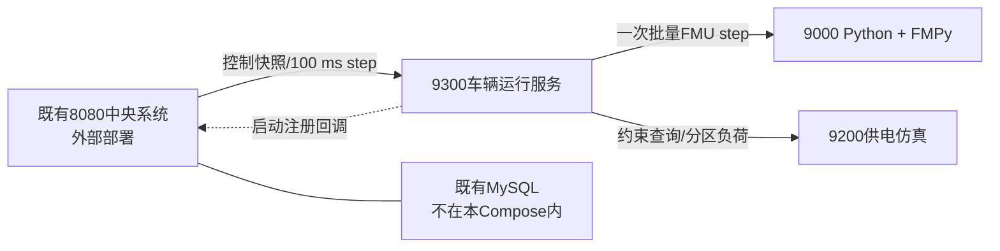

# 分计划04：车辆仿真部署、验收与收口（WP7～WP8）

> 上级计划：[真实车辆FMU集成实施计划](../真实FMU集成实施计划.md)
>
> 前置条件：9300、9000、9200的100 ms多车闭环已通过。
>
> 执行边界：部署配置只覆盖本轮修改的9000车辆FMU、9200供电仿真、9300车辆运行服务及`train_params.yaml`、`fmu_mapping.yaml`和连接超时。8080中央系统和MySQL继续使用既有部署与接口；只做兼容回归，不新增其容器。不得修改`App.vue`。

## 1. 部署边界和依赖



| 对象 | 本轮动作 | 配置来源 | 状态 |
|---|---|---|---|
| 9000 | 构建真实FMU镜像、健康检查、实例生命周期、故障恢复 | `config/train_params.yaml`、`config/fmu_mapping.yaml` | [已完成代码与编排] |
| 9200 | 构建独立FastAPI镜像、健康检查、权威供电约束 | 供电YAML及应用默认配置 | [已完成代码与编排] |
| 9300 | 构建Spring Boot镜像、批量执行、指标和降级开关 | 同一`train_params.yaml`、部署环境变量 | [已完成代码与编排] |
| 8080 | 仅配置指向9300/9200并做兼容回归 | 既有中央配置 | [外部依赖] |
| MySQL | 沿用中央系统原接口和原部署 | 既有数据库配置 | [不在范围] |

## 2. WP7：容器编排和故障恢复

### 2.1 前置条件

- Linux/amd64服务器安装Docker Engine和Docker Compose v2。
- 9000、9200、9300端口未占用，或已在`deploy/server.env`中改为可用端口。
- 9300能够访问现有中央系统`CENTRAL_BASE_URL`；中央系统能够访问9300和9200。
- `config/train_params.yaml`和`config/fmu_mapping.yaml`已经随同一代码提交部署。

### 2.2 实施动作与生成物

| 动作 | 生成物 | 验证 |
|---|---|---|
| 三服务Compose、健康依赖、重启和日志轮转 | `docker-compose.yml` | `docker compose config --quiet` |
| 固定Python 3.12、FastAPI 0.139.0、Uvicorn 0.51.0 | 两个Python镜像与锁定依赖 | 镜像构建成功、`/health`为UP |
| 同一车辆参数只读挂载至9000和9300 | `deploy/server.env.example` | 两端`parameterSetId`一致 |
| 9300增加批次、漏截止时间、fallback和FMI错误计数 | `/vehicle-runtime/health` | 指标可读且故障注入后递增 |
| 停机、单实例丢失、参数漂移、粘滞降级和RESYNC自动化 | `scripts/test-deployment-recovery.py` | `wp7-recovery.json`为PASS |
| 安全启动、停止和部署检查 | `scripts/deploy-server.sh`、`stop-server.sh`、`check-deployment.py` | 新环境一条命令可启动和校验 |

### 2.3 执行命令

```bash
cp deploy/server.env.example deploy/server.env
# 编辑CENTRAL_BASE_URL；跨服务器联调时同时配置监听地址和防火墙。
./scripts/deploy-server.sh deploy/server.env

python3 scripts/test-deployment-recovery.py \
  --env-file deploy/server.env \
  --output docs/真实FMU集成实施计划/验收记录/wp7-recovery.json

./scripts/stop-server.sh deploy/server.env down
```

### 2.4 回滚和退出条件

- 回滚：在`deploy/server.env`设置`COMPOSE_PROFILES=`和`VEHICLE_PHYSICS_MODE=JAVA_FALLBACK`，重新执行部署；不迁移、不创建、不删除MySQL数据。
- 停止顺序：9300 → 9000/9200，保证9000释放独立FMU实例。
- [验收条件] 三项仿真服务一次启动并全部健康，模型版本和参数哈希一致。
- [验收条件] 9000停机或实例丢失时9300确定性进入粘滞Java fallback。
- [验收条件] 9000恢复后不会自动热切回，只有显式`RESYNC`后恢复真实FMU。
- [验收条件] 参数哈希不一致返回HTTP 409和`FMU_PARAMETER_SET_MISMATCH`。

## 3. WP8：系统验收

### 3.1 自动化路径

`scripts/test-fmu-acceptance.sh`依次执行：

1. 构建并启动9000、9200、9300，核验健康、模型版本、参数哈希和FMU变量。
2. 执行WP7跨进程故障注入并保存机器可读报告。
3. 重建干净三服务运行时，避免故障计数和供电tick污染性能样本。
4. 依次执行1、2、10、20车基准，再执行20车6000个0.1 s仿真tick。
5. 执行9300、9200、9000测试。8080与前端不属于本服务器部署脚本；中央后端另行做兼容回归，前端保持`App.vue`不变并单独记录既有构建基线。
6. 默认按9300 → 9000/9200顺序停止三服务。

```bash
./scripts/test-fmu-acceptance.sh deploy/server.env
```

调试时可缩短非正式验收，但结果不得标记为最终WP8：

```bash
BENCHMARK_SAMPLES=10 ENDURANCE_TICKS=100 \
  ./scripts/test-fmu-acceptance.sh deploy/server.env
```

### 3.2 量化门槛

| 项目 | 门槛 | 报告字段 |
|---|---:|---|
| 通信步长 | 固定0.1 s | `criteria.stepSizeSeconds` |
| 20车9000批量时延 | p95 ≤ 50 ms | `endurance.fmuBatch.p95Millis` |
| 车辆与供电完整周期 | p95 ≤ 80 ms | `endurance.vehicleAndPower.p95Millis` |
| 20车长稳 | 6000 tick，即600 s仿真时间 | `endurance.ticks`、`simulatedSeconds` |
| 截止时间 | 新增漏100 ms截止时间为0 | `endurance.newMissedDeadlines` |
| Java fallback/FMI错误 | 干净性能运行中为0 | `fallbackTicks`、`newFmiErrors`、`finalHealth` |
| 物理保护状态 | 可出现并单独计数，不等同服务故障 | `degradedTicks` |
| 回归 | 9300/9200/9000测试、8080测试、前端构建全部通过 | 验收记录 |

### 3.3 生成物、回滚和退出条件

- 生成物：`wp7-health.json`、`wp7-recovery.json`、`wp8-performance.json`和`04-WP7-WP8验收记录.md`。
- 回滚：任一阻断项失败时保持`JAVA_FALLBACK`，保留失败报告和容器日志；不得宣称WP8完成。
- [验收条件] 1、2、10、20车基准满足时延门槛。
- [验收条件] 20车6000 tick无Java fallback、无FMI错误、无新增漏截止时间、无实例串扰；欠压/限流等真实物理保护产生的`DEGRADED`单独记录，不误判为服务故障。
- [验收条件] 既有中央和前端兼容回归通过且`App.vue`未修改。

## 4. 阶段记录

| 工作包 | 提交号 | 性能/验收报告 | 回滚演练 | 结论 |
|---|---|---|---|---|
| WP7 | `994f047` | `验收记录/wp7-health.json`、`wp7-recovery.json` | FMU停机、实例丢失、参数漂移、粘滞fallback、显式RESYNC | [已通过] |
| WP8 | `994f047` | `验收记录/wp8-performance.json`、`04-WP7-WP8验收记录.md` | Java fallback配置已提供 | [仿真部署范围已通过] |
