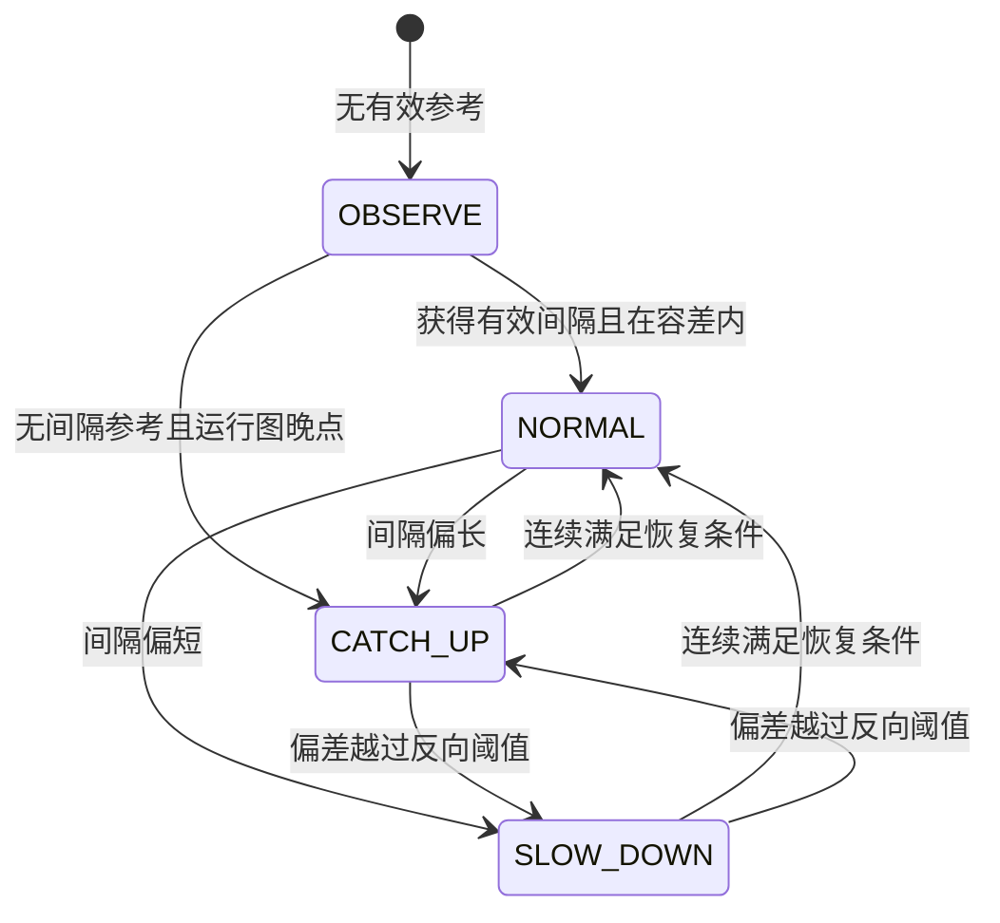
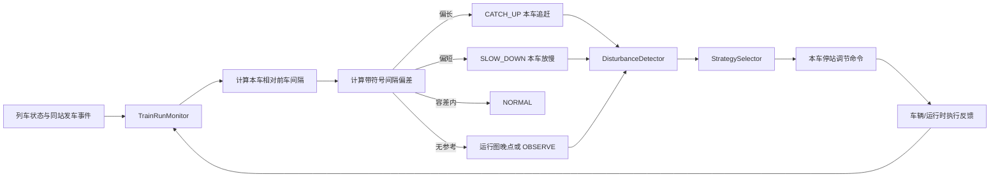
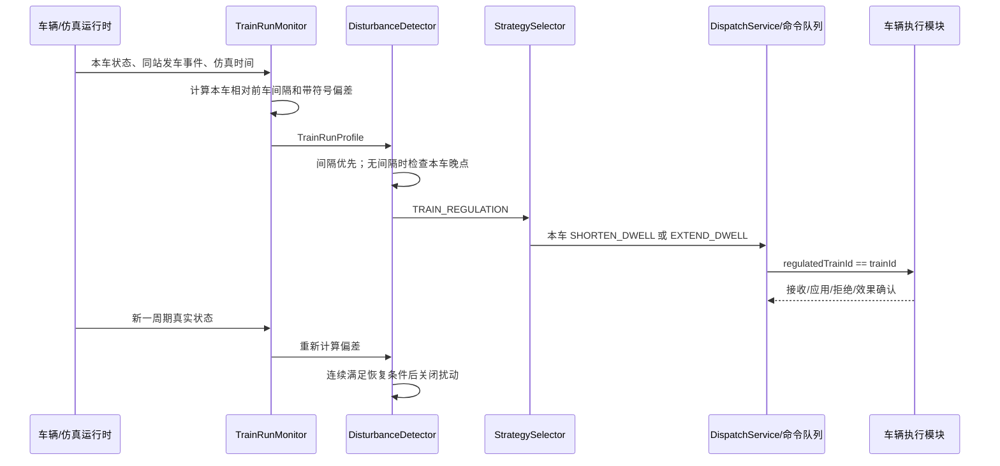

# 运营调度闭环 3.0 详细方案：统一本车调节模型

> 版本：3.0  
> 日期：2026-07-12  
> 范围：调度模块前后端，重点覆盖时间间隔调度闭环；路线/道岔调度沿用 2.x 已完成的意图仲裁、预约、超时和重试闭环。  
> 核心结论：所有新生成的时间间隔调节都作用于当前被观测列车本车，即 `regulatedTrainId == trainId`；`frontTrainId` 只用于计算间隔，不是控制对象。

## 1. 版本目标

3.0 将原来容易产生歧义的“间隔过长/过短后调节后车、下一辆车或关联车”统一为一个直接、可验证的本车控制模型：

- 本车与前车的实际间隔过长：本车追赶，动作 `CATCH_UP`。
- 本车与前车的实际间隔过短：本车放慢，动作 `SLOW_DOWN`。
- 本车与前车的间隔处于目标容差内：本车正常运行，动作 `NORMAL`。
- 暂无有效的同站发车参考数据：只观察，不做间隔干预，动作 `OBSERVE`。
- 首车或孤立车没有前车参考时，若本车相对运行图晚点，则允许以运行图晚点作为本车追赶依据。

该模型的目的不是让调度直接控制牵引或越过安全限制，而是让调度明确表达“哪一辆车需要向哪个方向调整”，再通过安全受限的停站时间、运行等级或目标速度建议完成闭环。

## 2. 2.x 模型的问题分析

### 2.1 控制对象不直观

旧语义中出现过 `SLOW_REAR_TRAIN`、`CATCH_UP_REAR_TRAIN` 等动作名。对于“当前观测车”和“被调节后车”的关系，前后端以及测试很容易产生不同理解：

- 当前事件的 `trainId` 是异常车还是参考车；
- 调节应作用当前车、前车还是下一辆车；
- 单车晚点与间隔过长是否会同时生成两条相同方向的命令；
- 页面显示的车和实际收到命令的车是否一致。

### 2.2 单车晚点与间隔偏差可能重复干预

一辆车既可能相对运行图晚点，又可能与前车间隔过长。如果两个检测器分别生成“晚点追赶”和“间隔追赶”，可能产生重复缩短停站、重复下发或重复记账。

3.0 将优先级规定为：

1. 有有效的前车同站间隔数据时，只根据间隔偏差调节本车。
2. 没有有效的前车间隔参考时，才使用本车运行图晚点作为降级依据。
3. 同一检测周期、同一列车只保留一个时间调节方向。

### 2.3 安全责任边界容易混淆

调度可以表达“追赶”或“放慢”，但不能直接绕过信号、联锁、移动授权、线路限速和车辆性能约束。3.0 将调度动作定义为运营目标，由下游模块决定可执行程度并反馈结果。

## 3. 3.0 核心原则

### 3.1 唯一控制对象

对于任意时间调节事件：

```text
regulatedTrainId = trainId
```

- `trainId`：本次被评估、被调节的当前列车。
- `regulatedTrainId`：明确的命令作用对象，3.0 中必须等于 `trainId`。
- `frontTrainId`：当前车的前车，只用于计算同站发车间隔。

任何新代码都不应根据 `frontTrainId` 推导命令接收车，也不应将动作隐式转移给“下一辆车”。

### 3.2 有间隔数据时，间隔优先

有效间隔能够直接描述本车相对前车的运行关系，因此优先于本车对运行图的绝对晚点。即使本车晚点，只要存在有效间隔数据，也只生成一条 `TRAIN_REGULATION` 事件。

### 3.3 无间隔数据时，运行图晚点降级

首车、孤立车或尚未取得同站发车记录的列车无法计算相对间隔：

- 未晚点或晚点未超过阈值：`OBSERVE` 或 `NORMAL`，不生成追赶命令。
- 晚点超过阈值：生成 `TRAIN_REGULATION`，方向为 `SCHEDULE_LATE`，作用本车并执行 `CATCH_UP`。

### 3.4 调度目标不突破安全边界

无论动作是追赶还是放慢，最终执行必须满足：

```text
可执行速度 <= min(移动授权允许速度, 线路限速, 车辆限速, 临时限速)
```

调度不得直接改变道岔位置、开放信号、扩大移动授权或强制车辆超过制动曲线。

## 4. 统一数学模型

### 4.1 同站实际发车间隔

设列车 `i` 的前车为 `i-1`，两车均已从同一参考站 `k` 发车：

```text
actualHeadway(i, k)
= departure(i, k) - departure(i-1, k)
```

只有下列条件同时满足时，实际间隔才有效：

- 两车属于同一运营分组，如同线路、同方向或相同可比运行路径；
- 当前车和前车都有有效的发车时刻；
- 发车事件来自同一参考站；
- 仿真时间基准一致，不能混用系统墙钟时间和仿真时间。

### 4.2 带符号间隔偏差

```text
headwayError(i, k)
= actualHeadway(i, k) - targetHeadway(k)
```

其中：

- `headwayError > 0`：本车落后于均匀间隔位置，与前车间隔偏长。
- `headwayError < 0`：本车过于接近前车，与前车间隔偏短。
- `headwayError = 0`：恰好达到目标间隔。

设容差为 `tolerance`：

```text
headwayError > tolerance
→ CATCH_UP
→ 调节本车 i 追赶

headwayError < -tolerance
→ SLOW_DOWN
→ 调节本车 i 放慢

abs(headwayError) <= tolerance
→ NORMAL

无有效参考数据
→ OBSERVE
```

当前实现的默认容差取目标间隔的 10%，同时不少于 5 秒：

```text
tolerance = max(5s, targetHeadway / 10)
```

### 4.3 首车运行图晚点

对没有有效前车参考的列车：

```text
scheduleDelay
= actualDeparture - plannedDeparture
```

当 `scheduleDelay` 超过配置阈值时：

```text
headwayDirection = SCHEDULE_LATE
regulationAction = CATCH_UP
regulatedTrainId = trainId
```

该逻辑只是无间隔参考时的降级路径，不能与有效间隔事件重复生效。

## 5. 本车调节动作

| 动作 | 中文语义 | 触发条件 | 在站执行 | 运行中执行目标 |
|---|---|---|---|---|
| `CATCH_UP` | 本车追赶 | 间隔偏长，或无前车参考且本车晚点 | 在允许范围内缩短本车当前/下一次停站 | 请求更积极的运行等级，但仍受 MA、限速和车辆能力限制 |
| `SLOW_DOWN` | 本车放慢 | 间隔偏短 | 延长本车停站，优先在站调整 | 请求常规或节能运行等级，不得采用不安全的在线强制制动 |
| `NORMAL` | 本车正常运行 | 间隔在容差范围内 | 使用计划停站时间 | 使用正常运行等级 |
| `OBSERVE` | 等待参考数据 | 无法计算有效间隔且无明确晚点恢复需求 | 不干预 | 不干预 |

### 5.1 为什么优先调整停站时间

停站时间是当前调度模块可以明确表达且较容易验证的运营控制量：

- 追赶：生成 `SHORTEN_DWELL`，通过负的 `deltaDwellSec` 缩短停站。
- 放慢：生成 `EXTEND_DWELL`，通过正的 `deltaDwellSec` 延长停站。
- 命令中写入 `executeOnNextDwell=true` 时，表示列车当前不在站，命令在下一次停站兑现。

停站调整必须设置上下限，不能缩短至低于开关门、乘降和安全确认所需的最小停站时间，也不能无限延长导致新的拥堵。

### 5.2 运行中速度调节的后续接口

当前代码对运行中的直接追赶能力仍受车辆接口限制。建议车辆模块后续支持离散运行等级，而不是调度直接指定任意牵引值：

```text
FAST          积极运行，在全部安全上限内尽量恢复
NORMAL        正常运行
ENERGY_SAVING 节能/舒缓运行，用于间隔偏短
```

车辆模块应返回实际接受等级、受限原因和预计效果；调度根据反馈继续观察，而不是假定命令必然完全执行。

## 6. 状态与扰动模型

### 6.1 统一扰动类型

3.0 新自动检测统一使用：

```text
TRAIN_REGULATION
```

方向字段 `headwayDirection` 描述触发来源：

| 方向 | 含义 | 动作 |
|---|---|---|
| `TOO_LONG` | 本车与前车间隔过长 | `CATCH_UP` |
| `TOO_SHORT` | 本车与前车间隔过短 | `SLOW_DOWN` |
| `SCHEDULE_LATE` | 无前车参考，本车相对运行图晚点 | `CATCH_UP` |

旧类型 `HEADWAY_VIOLATION`、`DEPARTURE_DELAY` 和旧动作名可以暂时保留反序列化、历史记录展示或兼容测试，但 3.0 自动检测不再同时生成它们。

### 6.2 恢复条件

扰动恢复采用稳定确认而不是一次采样立即关闭：

- `TOO_LONG`、`TOO_SHORT`：间隔回到恢复阈值内，并连续满足配置的恢复 tick 数。
- `SCHEDULE_LATE`：本车晚点下降到恢复阈值内，并连续满足配置的恢复 tick 数。
- 恢复后的事件标记为 `RECOVERED`，不应继续产生新命令。
- 冷却时间内不重复打开同一列车同方向的相同事件。

### 6.3 状态机



## 7. 后端闭环设计

### 7.1 数据流



### 7.2 `TrainRunMonitor`

职责：

- 按可比较运营分组确定前后顺序；
- 使用同站发车记录计算 `headwayActualSec`；
- 计算 `headwayDeviationSec = actual - target`；
- 输出 `CATCH_UP`、`SLOW_DOWN`、`NORMAL`、`OBSERVE`；
- 只有首车/无前车参考且存在晚点时，输出本车 `CATCH_UP`。

输出中的 `frontTrainId` 只表示测量参考，不表示命令接收者。

### 7.3 `DisturbanceDetector`

职责：

- 有有效间隔时，只按 `TOO_LONG` 或 `TOO_SHORT` 生成 `TRAIN_REGULATION`；
- 无有效间隔且晚点超过阈值时，生成 `SCHEDULE_LATE`；
- 同车同周期避免生成间隔与晚点两条重复事件；
- 维护确认 tick、恢复 tick 和冷却时间；
- 记录目标间隔、实际间隔、容差和超限值，便于复盘。

### 7.4 `StrategySelector`

职责：

- `TOO_LONG`、`SCHEDULE_LATE`：对 `event.trainId` 生成 `SHORTEN_DWELL`，动作 `CATCH_UP`。
- `TOO_SHORT`：对 `event.trainId` 生成 `EXTEND_DWELL`，动作 `SLOW_DOWN`。
- `DWELL_EXTENDED` 等兼容事件仍可映射为本车追赶。
- 命令 payload 必须显式携带本车调节字段。

标准 payload 示例：

```json
{
  "regulatedTrainId": "TR-001",
  "regulationAction": "CATCH_UP",
  "regulationSource": "TRAIN_REGULATION",
  "deltaDwellSec": -3,
  "executeOnNextDwell": true
}
```

### 7.5 `DispatchService` 与快照

快照向前端提供三层一致的本车信息：

- 列车观测层：本车是谁、参考前车是谁、偏差和动作是什么。
- 扰动层：哪辆本车因何触发调节。
- 命令层：最终命令实际作用到哪辆本车。

必须满足以下可追踪不变量：

```text
profile.regulatedTrainId == profile.trainId
disturbance.regulatedTrainId == disturbance.trainId
command.regulatedTrainId == command.trainId
```

## 8. 前端页面与交互

### 8.1 本车间隔调节面板

新增本车调节面板，按列车展示：

- 调节本车 ID；
- 参考前车 ID；
- 实际间隔；
- 带符号间隔偏差；
- 本车动作；
- 动作原因。

页面必须把“控制对象”和“测量参考”分开显示，避免把前车误认为被控制车辆。

### 8.2 间隔图表

间隔图表以当前车为横轴，展示当前车相对前车的实际间隔和目标间隔。实际柱颜色按本车动作区分：

- 橙色：`CATCH_UP`；
- 红色：`SLOW_DOWN`；
- 绿色：`NORMAL`；
- 灰色：`OBSERVE`。

悬浮提示必须同时显示实际间隔、带符号偏差和本车动作。

### 8.3 扰动与命令展示

- 扰动列表支持 `TRAIN_REGULATION`、`TOO_LONG`、`TOO_SHORT`、`SCHEDULE_LATE`。
- 命令时间线显示“本车追赶：缩短停站”或“本车放慢：延长停站”。
- 调试页手工演示命令同样写入 `regulatedTrainId`、`regulationAction`、`regulationSource`。
- 旧状态只以“兼容旧状态”方式展示，不能作为主要 UI 术语。

## 9. 前后端 API 字段

### 9.1 列车观测 `TrainProfileView`

| 字段 | 类型 | 含义 |
|---|---|---|
| `trainId` | string | 当前被观测列车 |
| `regulatedTrainId` | string | 被调节本车，3.0 等于 `trainId` |
| `frontTrainId` | string/null | 计算间隔使用的参考前车 |
| `headwayActualSeconds` | number/null | 本车与前车的实际同站发车间隔 |
| `headwayErrorSeconds` | number/null | `actual - target`，保留正负号 |
| `headwayDeviationSeconds` | number | 兼容的整数偏差字段 |
| `regulationAction` | string | `CATCH_UP/SLOW_DOWN/NORMAL/OBSERVE` |
| `regulationReason` | string | 可解释的触发原因 |

`regulationReason` 当前取值：

```text
HEADWAY_TOO_LONG
HEADWAY_TOO_SHORT
HEADWAY_ON_TARGET
SCHEDULE_DELAY_RECOVERY
WAITING_FOR_REFERENCE_DATA
```

### 9.2 扰动 `DisturbanceView`

| 字段 | 含义 |
|---|---|
| `trainId` | 当前异常列车 |
| `regulatedTrainId` | 实际调节本车 |
| `disturbanceType` | 3.0 新事件为 `TRAIN_REGULATION` |
| `regulationAction` | 本车追赶或放慢方向 |
| `headwayDirection` | `TOO_LONG/TOO_SHORT/SCHEDULE_LATE` |
| `targetHeadwaySec` | 目标间隔 |
| `actualHeadwaySec` | 实际间隔 |
| `toleranceSec` | 判断容差 |
| `violationSec` | 超出阈值的量 |

### 9.3 命令 `CommandView`

| 字段 | 含义 |
|---|---|
| `trainId` | 命令所属列车 |
| `regulatedTrainId` | 命令实际作用本车 |
| `commandType` | 如 `SHORTEN_DWELL`、`EXTEND_DWELL` |
| `regulationAction` | `CATCH_UP` 或 `SLOW_DOWN` |
| `status` | 待发送、已发送、已应用、已确认、超时等 |
| `reason` | 命令生成原因 |

## 10. 与路线/道岔调度闭环的关系

3.0 的本车间隔模型不回退路线调度 2.x 已有能力，路线调度继续保留：

- 路线意图生成与仲裁；
- 多车竞争时的优先级评分；
- 选中列车、等待列车记录；
- 路线请求与预约；
- 预约有效期和过期处理；
- 请求失败后的冷却和有限次数重试；
- 联锁接受、拒绝和路线建立反馈闭环。

时间调节和路线调度的协调原则：

1. 本车即使需要 `CATCH_UP`，未获得安全路线和移动授权时也不能越过边界。
2. 本车因路线冲突等待时，调度应记录路线等待原因，避免反复生成无效追赶命令。
3. 路线建立后，本车仍按照最新间隔偏差决定停站或运行等级。
4. 道岔状态和信号开放只能由联锁模块决定，调度只能提出路线意图。

## 11. 信号与轨道模块需要配合的事项

以下内容不属于本次调度代码修改，但闭环完整运行需要信号/轨道/联锁模块提供：

### 11.1 可靠的同站事件与占用状态

- 提供列车进入站台、停车、发车、离开站台的仿真时间戳。
- 明确站点、轨道区段、线路方向和列车 ID 的关联。
- 保证事件顺序和时间基准一致，避免用系统时间替代仿真时间。
- 对事件重复、乱序或缺失给出可识别的质量标志。

### 11.2 移动授权与限速

- 提供当前列车 MA 终点、允许速度、线路限速和临时限速。
- 当调度提出追赶目标时，返回是否受前方占用、信号关闭、路线未建立或临时限速限制。
- 任何调度速度建议都必须在信号/轨道安全约束之后裁剪。

### 11.3 路线和道岔反馈

- 接收 `REQUEST_ROUTE` 或等价路线意图。
- 返回接受、拒绝、建立中、已建立、释放和失败状态。
- 拒绝时返回明确原因，如区段占用、敌对路线、道岔故障、预约过期。
- 返回实际锁闭的路线和道岔状态，供调度确认效果。

## 12. 车辆模块需要配合的事项

以下内容不属于本次调度代码修改，但运行中追赶/放慢需要车辆模块提供：

### 12.1 停站调节执行

- 接收 `SHORTEN_DWELL`、`EXTEND_DWELL`。
- 支持当前停站或下一停站执行标志。
- 执行前应用最小/最大停站时间限制。
- 返回实际采用的停站时间、拒绝原因和执行时间。
- 乘降、车门或安全条件不满足时必须拒绝缩短，并将原因反馈调度。

### 12.2 运行等级接口

建议支持：

```text
FAST
NORMAL
ENERGY_SAVING
```

并反馈：

- 实际接受的运行等级；
- 当前安全允许的目标速度；
- 受 MA、线路限速、车辆限速、制动曲线或牵引能力限制的原因；
- 预计可恢复时间或预计间隔改善量。

### 12.3 命令幂等与状态反馈

- 使用命令 ID 保证重复投递不重复执行。
- 至少反馈 `RECEIVED/APPLIED/EFFECT_CONFIRMED/REJECTED/TIMEOUT` 等阶段。
- 效果确认应基于真实停站变化或运行等级变化，不能仅表示消息已收到。

## 13. 安全边界与保护策略

### 13.1 追赶不是无条件加速

`CATCH_UP` 表示运营目标，不等于直接提高牵引。下游必须先检查：

- 移动授权是否足够；
- 前方轨道是否空闲；
- 路线是否建立并锁闭；
- 当前速度是否接近线路/车辆限速；
- 制动曲线和停车目标是否允许；
- 最小停站和乘降条件是否满足。

### 13.2 放慢优先采用平滑手段

`SLOW_DOWN` 优先通过延长停站或节能运行实现，不建议由调度直接触发突兀制动。紧急制动仍属于车辆保护和信号安全逻辑。

### 13.3 防振荡

为防止列车在追赶和放慢之间频繁切换，应使用：

- 判断容差；
- 恢复阈值；
- 连续确认 tick；
- 连续恢复 tick；
- 事件冷却时间；
- 单车同周期单一调节方向。

## 14. 闭环时序



## 15. 测试方案

### 15.1 监测器单元测试

- 实际间隔大于目标加容差：本车 `CATCH_UP`。
- 实际间隔小于目标减容差：本车 `SLOW_DOWN`。
- 偏差在容差内：本车 `NORMAL`。
- 有前车但缺少同站发车数据：`OBSERVE`。
- 无前车且晚点：本车 `CATCH_UP`。
- 偏差正负号满足 `actual - target`。

### 15.2 扰动检测测试

- `TOO_LONG` 生成一个 `TRAIN_REGULATION`。
- `TOO_SHORT` 生成一个 `TRAIN_REGULATION`。
- 无间隔且晚点生成 `SCHEDULE_LATE`。
- 有有效间隔且本车同时晚点，只生成一条间隔事件，不生成重复 `SCHEDULE_LATE`。
- 连续恢复 tick 达标才关闭事件。
- 冷却期内不重复打开相同事件。

### 15.3 策略测试

- `TOO_LONG`：命令对象为本车，payload 为 `CATCH_UP`。
- `TOO_SHORT`：命令对象为本车，payload 为 `SLOW_DOWN`。
- `SCHEDULE_LATE`：命令对象为本车，生成安全的停站缩短，不直接写不受约束的加速比例。
- 所有命令都满足 `regulatedTrainId == trainId`。

### 15.4 快照和前端测试

- 列车、扰动、命令三层的 `regulatedTrainId` 一致。
- 本车面板能区分调节本车与参考前车。
- 图表正确显示正负偏差及动作颜色。
- 扰动列表正确显示 `TRAIN_REGULATION`。
- 命令时间线显示本车追赶/放慢而不是“调节后车”。
- Vue TypeScript 类型检查通过。
- Vite 生产构建通过。

### 15.5 集成测试

- 本车间隔过长，在站缩短停站，下一站间隔回落并恢复事件。
- 本车间隔过短，在站延长停站，下一站间隔回升并恢复事件。
- 追赶命令因路线未建立而受限，调度不突破 MA，路线建立后再观察实际效果。
- 车辆拒绝缩短停站时，命令记录拒绝原因，调度不假定效果已实现。
- 多车连续偏差时，每辆车依据各自相对前车间隔独立调节，不把命令错发给参考前车。

## 16. 验收场景

### 场景 A：间隔过长

```text
目标间隔：300s
实际间隔：390s
偏差：+90s
期望动作：CATCH_UP
调节对象：当前本车
```

验收：页面、扰动、命令三处显示同一 `regulatedTrainId`；若在站则生成缩短停站命令。

### 场景 B：间隔过短

```text
目标间隔：300s
实际间隔：210s
偏差：-90s
期望动作：SLOW_DOWN
调节对象：当前本车
```

验收：生成本车延长停站命令，不调节前车或下一辆车。

### 场景 C：本车晚点且间隔过长

```text
运行图晚点：120s
实际间隔：420s
偏差：+120s
```

验收：只生成一条 `TRAIN_REGULATION/TOO_LONG`，不再额外生成 `SCHEDULE_LATE` 或 `DEPARTURE_DELAY`。

### 场景 D：首车晚点

```text
frontTrainId：null
实际间隔：null
运行图晚点：超过阈值
```

验收：生成 `TRAIN_REGULATION/SCHEDULE_LATE`，本车 `CATCH_UP`。

### 场景 E：无有效参考且未晚点

验收：动作 `OBSERVE` 或 `NORMAL`，不生成无依据的调节命令。

### 场景 F：安全条件限制追赶

本车需要追赶，但前方路线未建立或 MA 受限。验收：调度目标可以存在，车辆实际速度不得突破安全限制；反馈中记录受限原因。

## 17. 兼容与迁移

### 17.1 保留兼容项

- 旧事件类型 `HEADWAY_VIOLATION`、`DEPARTURE_DELAY` 可继续读取历史记录。
- 旧动作 `SLOW_REAR_TRAIN`、`CATCH_UP_REAR_TRAIN` 可在前端显示为“本车放慢/追赶（兼容旧状态）”。
- 旧字段在外部调用仍存在时可暂时保留，但新逻辑以 `regulationAction` 和 `regulatedTrainId` 为准。

### 17.2 禁止新增旧语义

新代码、新接口、新页面和新测试不得再以“后车”“下一辆车”作为默认控制对象。若确有编组、接续或全线优化需要调节其他车，必须另建明确的跨车协调策略，并显式提供目标车 ID，不能复用本车间隔事件。

### 17.3 路线调度保持兼容

路线意图仲裁、等待列车、优先级评分、路线预约、过期和冷却重试等 2.x 功能继续保留。本次 3.0 只统一时间间隔调节的控制对象和数据表达，不改变联锁安全职责。

## 18. 当前实现文件清单

### 后端

- `backend/src/main/java/com/railwaysim/dispatch/monitor/TrainRunMonitor.java`
- `backend/src/main/java/com/railwaysim/dispatch/disturbance/DisturbanceDetector.java`
- `backend/src/main/java/com/railwaysim/dispatch/disturbance/DisturbanceType.java`
- `backend/src/main/java/com/railwaysim/dispatch/strategy/StrategySelector.java`
- `backend/src/main/java/com/railwaysim/dispatch/strategy/TrainRegulationAction.java`
- `backend/src/main/java/com/railwaysim/dispatch/DispatchSnapshot.java`
- `backend/src/main/java/com/railwaysim/dispatch/DispatchService.java`

### 前端

- `frontend/src/types/dispatch.ts`
- `frontend/src/components/dispatch/SelfRegulationPanel.vue`
- `frontend/src/components/dispatch/HeadwayChart.vue`
- `frontend/src/components/dispatch/DisturbanceList.vue`
- `frontend/src/components/dispatch/CommandTimeline.vue`
- `frontend/src/views/dispatch/DispatchView.vue`
- `frontend/src/views/dispatch/DispatchLoopDebugView.vue`

### 测试

- `backend/src/test/java/com/railwaysim/dispatch/monitor/TrainRunMonitorTests.java`
- `backend/src/test/java/com/railwaysim/dispatch/disturbance/DisturbanceDetectorTests.java`
- `backend/src/test/java/com/railwaysim/dispatch/StrategySelectorTests.java`

## 19. 后续 3.1 建议

1. 车辆模块实现 `FAST/NORMAL/ENERGY_SAVING` 离散运行等级及效果反馈。
2. 信号轨道模块补齐统一仿真时钟下的站台到发、占用、MA 和限速事件。
3. 将调节量从固定停站增减升级为按偏差分级、带上下限和抗积分饱和的控制器。
4. 将路线等待原因纳入时间调节抑制条件，避免受联锁限制时反复生成追赶命令。
5. 增加全链路相关 ID：观测 ID、扰动 ID、命令 ID、反馈 ID，便于闭环追踪。
6. 增加趋势指标：平均绝对间隔偏差、恢复耗时、命令接受率、效果确认率和反向振荡次数。
7. 在不改变安全职责的前提下，研究多车预测控制；若需要跨车协调，必须明确每一条命令的实际目标车。

## 20. 最终判定规则

3.0 是否实现正确，可以用下面四句话快速判断：

1. 看哪辆车的间隔，就调节哪辆本车。
2. 前车只用于计算间隔，不接收当前车的调节命令。
3. 有有效间隔时不再重复叠加单车晚点命令。
4. 调度只表达运营目标，信号联锁和车辆保护始终拥有安全约束优先权。
